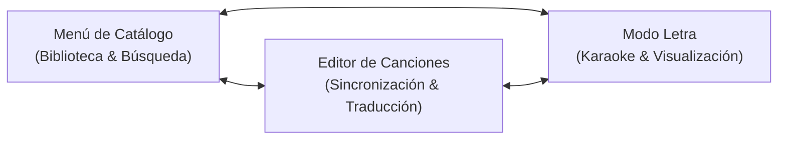

# SarangaBaranga (`proy-letras`) 🎤

> **Reproductor de Karaoke Web y Editor de Letras Sincronizadas**  
> Aplicación web moderna, autónoma (*Zero-Backend*) y centrada en la privacidad, pensada tanto para cantar en tiempo real como para crear, sincronizar y traducir letras musicales con precisión de milisegundos.

---

## 🌟 Visión General

**SarangaBaranga** convierte cualquier navegador web en una estación completa de karaoke y sincronización de letras. A diferencia de las plataformas tradicionales que requieren registro de usuario o servidores centrales, todo funciona **100% del lado del cliente** utilizando **IndexedDB** para almacenar tu catálogo local de canciones de forma privada y permanente.

### Puntos Destacados

* 🎶 **Reproducción Híbrida y Discreta:** Sincronización gobernada por un *Master Clock* con la YouTube IFrame API (el video permanece invisible para priorizar la experiencia de audio) o mediante archivos de audio locales/remotos.
* 🎙️ **Canto Sílaba a Sílaba (*Richsync*):** Resaltado continuo y dinámico palabra por palabra o sílaba a sílaba sin saltos bruscos ni deformaciones tipográficas.
* 🌐 **Soporte Multilingüe Real:** Idioma original cantado con opción de visualización fonética (Romaji) y subtitulado bilingüe con traducciones ilimitadas debajo del verso principal.
* 🔍 **Búsqueda Multi-Motor Online:** Conexión simultánea con catálogos comunitarios masivos como **BetterLyrics/Unison**, **LRC.red** (~29 millones de canciones), **LRCLIB** y **Genius**, además de importación directa de videos y listas de YouTube sin necesidad de claves de API.
* 🔄 **Formatos Estándar y Compartición:** Exportación e importación en paquetes JSON portables (`song-package.json`), compatibilidad bidireccional con el estándar abierto **Lyricsfile 1.0** (`.lyricsfile.yaml`) y archivos `.lrc`.
* 🎨 **Temas y Adaptabilidad Total:** Personalización cromática completa, tamaños de fuente fluidos y diseño adaptativo optimizado tanto para pantallas de escritorio como para teléfonos móviles (vertical y horizontal).

---

## 🧭 Estructura y Navegación por la Interfaz

La aplicación se compone de **tres pantallas principales** y una **barra superior global**:



### Encabezado Global (Header)
En todo momento visible en la parte superior:
* **Logo `SarangaBaranga`:** Al hacer clic, vuelve de forma instantánea a la pantalla del menú/catálogo.
* **Información de Canción:** Muestra el título y artista del tema cargado o sonando.
* **Botón `Playlist`:** Abre el modal de la cola de reproducción actual y muestra el número de temas en cola.
* **Botón `Modo Letra` (Micrófono):** Aparece cuando hay una canción sonando de fondo para regresar a la pantalla de karaoke con un solo toque.
* **Botón `Temas`:** Abre el panel de personalización visual (colores de interfaz, colores de letra cantada, tamaños de fuente y alertas).
* **Botón `Menú / Volver`:** Botón contextual para regresar a la lista de canciones.

---

## 🎤 Tutorial: Guía para Usuarios de Karaoke

Si tu objetivo es disfrutar cantando o escuchando música con letras en tiempo real:

### 1. Seleccionar o Buscar una Canción
1. En la pantalla principal (**Menú de Canciones**), explora tu catálogo local en vista de **Cuadrícula** (tarjetas) o **Lista** (filas compactas) usando el interruptor de vista.
2. Utiliza la barra de búsqueda superior para filtrar instantáneamente por título o artista.
3. Si organizas tu música por carpetas temáticas, selecciona las pestañas de **Bibliotecas** (ej. *Favoritos*, *Anime*, *Rock*).

### 2. Entrar a Modo Letra
* Haz clic directamente sobre la tarjeta o presiona el botón **🎤 Modo Letra**.
* La reproducción comenzará de inmediato y la pantalla pasará al escenario de canto enfocado.

### 3. Controles en Modo Letra (Barra Inferior)
* **Play / Pausa y Barra de Progreso:** Controla la reproducción o arrastra el control deslizante para desplazarte a cualquier punto de la canción.
* **Anterior / Siguiente:** Navega entre los temas de tu playlist activa.
* **Volumen y Mute:** Ajusta el nivel de audio maestro o silencia con un clic.
* **Pantalla Completa (Inmersiva):** Presiona el botón de pantalla completa para ocultar las barras y disfrutar de las letras en pantalla limpia. Para salir, usa el botón flotante en la esquina o la tecla `Esc`.
* **Saltar a un Verso:** Puedes hacer clic en cualquiera de las frases anteriores o siguientes que aparecen en pantalla para saltar el audio directamente a ese momento.

### 4. Ajustes de Lectura y Pistas (Icono de Ruedita ⚙️)
Al pulsar el botón de opciones en la barra de controles, se despliega el menú de configuración rápida:
* **Selector de Video / Pista:** Alterna entre el video original cantado y la pista instrumental/karaoke.
* **Calibrador de Offset (`-0.1s` / `+0.1s`):** Si notas que la letra va ligeramente adelantada o atrasada respecto a la música, ajusta el desfase en vivo con estos botones sin interrumpir la canción; el cambio se guarda automáticamente.
* **Frases Anteriores y Siguientes:** Elige cuántas frases pasadas ver (0 a 3) y cuántas frases futuras previsualizar (0 a 3). Si seleccionas *0 siguientes*, se activa el modo **Solo frase actual**, centrando la línea en pantalla.
* **Modo de Texto (Original / Romaji / Ambos):** Para canciones con escritura no latina (como japonés), conmuta entre ver los caracteres originales, la pronunciación fonética o ambos simultáneamente.
* **Traducción:** Activa o desactiva la pista de traducción para ver subtítulos sincronizados en tu idioma en cursiva debajo de la línea principal.

---

## ✍️ Tutorial: Guía para Creadores de Letras

SarangaBaranga incluye herramientas de precisión para sincronizar compases, versos y sílabas.

### 1. Iniciar una Nueva Canción
Tienes tres alternativas desde el menú principal:
1. **Buscar y precargar online (Recomendado):** Haz clic en **Agregar canción** para abrir el buscador unificado. Busca en *BetterLyrics*, *LRC.red*, *LRCLIB* o *Genius*, o pega un enlace de YouTube en la pestaña *YouTube*. Al seleccionar un resultado, se precargarán el video, la letra, las sílabas e incluso la traducción directamente en el editor.
2. **Crear desde cero:** Presiona el botón **`+`** en la cabecera del buscador online para abrir un lienzo en blanco.
3. **Importar archivo:** Usa el icono de subida en el modal de búsqueda para cargar un archivo `.json` de SarangaBaranga, un `.lyricsfile.yaml` o un archivo `.lrc`.

### 2. Estructura del Editor de Canciones
La pantalla del editor se organiza en tres zonas principales:

#### A. Asistente de Audio Superior (Herramienta de Sincronización)
* **Mini Reproductor y Reloj en Vivo:** Muestra el tiempo actual con precisión de milisegundos (`mm:ss.mmm`).
* **Botones de Transporte Rápido:** Salta hacia atrás o adelante con precisión quirúrgica (`-5s`, `-1s`, `-0.1s`, `+0.1s`, `+1s`, `+5s`).
* **Botón `Probar en Modo Letra` (Micrófono):** Permite pasar instantáneamente al modo karaoke para comprobar cómo se siente cantar el tema.
* **Guardado Automático:** Toda modificación se guarda en segundo plano en IndexedDB con aviso visual de estado.

#### B. Metadatos y Gestión de Videos
* Define el **Título**, **Artista**, **Géneros** y **Etiquetas**.
* En **Videos Asociados**, puedes añadir múltiples URLs de YouTube (ej. pista oficial, karaoke, versión en vivo) y definir un `offset` en segundos para cada una.
* Al final de esta sección dispones de opciones de **Respaldo individual** para exportar la canción como paquete JSON o archivo YAML Lyricsfile.

#### C. Línea de Tiempo de Frases y Sílabas
* **Pestañas de Idiomas:** Cada canción puede tener múltiples pistas lingüísticas. Una está marcada como principal (`isMain`) y las demás como traducciones. Puedes renombrar idiomas, asignar códigos ISO y añadir nuevas traducciones con el botón `+`.
* **Edición de Versos:**
  * Define `Inicio (s)` y `Fin (s)` de cada frase con inputs numéricos limpios.
  * Presiona el botón de preescucha (Play pequeño) en cada tarjeta para escuchar únicamente ese fragmento.
* **Sincronización Silábica (Ponderación Fonética):**
  * Al expandir una frase en el idioma principal, puedes ajustar la duración de cada sílaba o palabra.
  * El botón **Distribuir** utiliza un algoritmo de ponderación fonética musical que calcula automáticamente el peso de vocales abiertas, diptongos, consonantes y alargamientos de fin de frase.
  * Si prefieres empezar de nuevo, cuentas con botones para vaciar sílabas por frase o el botón **Borrar todas las sílabas** para un reseteo masivo.
* **Herramientas Inteligentes Integradas:**
  * **✨ Romaji Automático:** Para canciones en japonés, genera la transcripción fonética Hepburn para cada sílaba y frase respetando espacios y puntuación.
  * **Traducción Automática Gratuita:** Traduce un verso individual con un clic o utiliza **Traducir Toda la Canción** (mediante Unison API y MyMemory API) para generar una pista secundaria completa sin alterar pausas instrumentales.
  * **Guía de Referencia:** Al editar una traducción, cada tarjeta te muestra arriba el verso original como referencia contextual para facilitar la adaptación.

---

## 📚 Bibliotecas, Playlists y Respaldo

* **Listas de Reproducción (Playlists):** Crea una cola dinámica de temas desde el modal de Playlist o añade temas desde las tarjetas del catálogo. Puedes reordenar con flechas arriba/abajo, activar el modo aleatorio (shuffle) o guardar la cola actual como una nueva biblioteca permanente.
* **Bibliotecas Temáticas:** Organiza canciones en grupos independientes (N:M). Puedes exportar una biblioteca completa en un archivo `biblioteca-<nombre>.json` para compartirla con amigos; al importarla en otro equipo, el sistema preguntará si deseas combinarla o crear una nueva sin colisiones.
* **Respaldo Completo del Sistema:** En la barra del menú principal, el botón **Respaldo Completo** genera una copia de seguridad en JSON de toda tu base de datos local (canciones, artistas, bibliotecas y configuraciones), lista para restaurarse en cualquier momento o migrar a otro navegador.

---

## 🛠️ Comandos de Desarrollo y Ejecución Local

Para clonar y ejecutar el proyecto en tu entorno local:

```bash
# 1. Instalar dependencias
npm install

# 2. Iniciar servidor de desarrollo con Vite
npm run dev

# 3. Ejecutar suite de pruebas unitarias y de integración (Vitest)
npm test

# 4. Compilar para producción (dist estático)
npm run build

# 5. Previsualizar la compilación de producción localmente
npm run preview
```

### Arquitectura Técnica
* **Entorno:** [Vite](https://vitejs.dev/) + Vanilla JavaScript modular (ES Modules).
* **Persistencia:** [idb](https://github.com/jakearchibald/idb) (IndexedDB v3).
* **Audio:** YouTube IFrame Player API + HTML5 Audio.
* **Formatos:** YAML 1.0 ([js-yaml](https://github.com/nodeca/js-yaml)), JSON Schema, TTML y LRC.
* **Testing:** [Vitest](https://vitest.dev/) con entorno Happy-DOM y Fake-IndexedDB (27 suites, 310 tests).
* **Despliegue:** GitHub Pages (SPA estática con despliegue continuo vía GitHub Actions).

---

## 📄 Licencia

Este proyecto es de código abierto bajo la licencia MIT.
