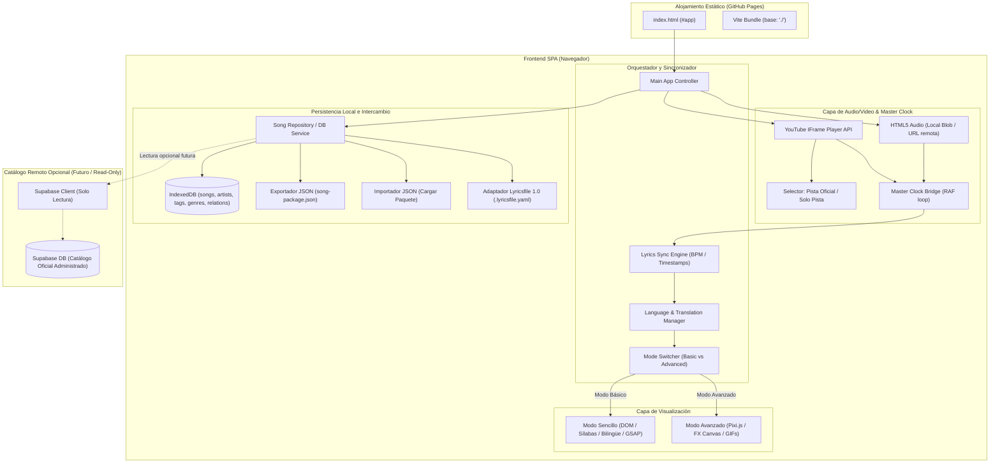

# Diseño Técnico y Arquitectura: SarangaBaranga (`proy-letras`)

> **Arquitectura del Sistema y Patrones de Software**  
> **Versión:** 2.3.0  
> **Plataforma:** SPA Estática (GitHub Pages / `usuario.github.io`) + Persistencia Local en Navegador (IndexedDB), Intercambio JSON & Compatibilidad con Estándar Abierto `lyricsfile` (.lyricsfile.yaml) (+ Catálogo Opcional Supabase Read-Only a futuro)

---

## 1. Visión General de la Arquitectura

**SarangaBaranga** opera como una aplicación web sin servidor propio (*Zero-Backend Architecture*), diseñada para compilarse como un conjunto de archivos estáticos (HTML, JS, CSS) compatibles con **GitHub Pages**.

La persistencia de datos y el catálogo de canciones se gestiona primariamente **en el navegador del usuario mediante IndexedDB**, implementando un modelo relacional estructurado (`artists`, `songs`, `tags`, `genres`, `song_tags`, `song_genres`) con campos JSON para configuraciones temporales, visuales y de letras multilingües (`lyrics_data`, `visuals_data`).

Para permitir compartir creaciones e interoperar con fuentes externas sin requerir login ni backend de validación de subidas:
1. **Exportación / Importación JSON:** Los usuarios pueden exportar sus canciones a archivos JSON portables (`song-package.json`) y compartirlos. Al importar un archivo, el sistema lo valida y lo almacena localmente en IndexedDB.
2. **Compatibilidad con Estándar `lyricsfile` (YAML):** Soporte nativo para importar y exportar archivos en formato abierto `.lyricsfile.yaml` ([especificación 1.0](https://github.com/tranxuanthang/lyricsfile/blob/main/SPECIFICATION.md)), permitiendo cargar canciones o traducciones desde repositorios comunitarios de letras.
3. **Catálogo Remoto Opcional (Futuro / Read-Only):** A futuro, la aplicación podrá consultar opcionalmente una instancia de Supabase en modo estrictamente de **Solo Lectura** como catálogo curado por el autor, manteniendo todas las operaciones de escritura y creación en el ámbito local o manual del administrador.

El audio se reproduce principalmente a través de la **YouTube IFrame Player API** (video oficial y solo pista) o mediante elementos de audio HTML5 para archivos locales/remotos.



---

## 2. Separación de Datos: Esquema Modular, Persistencia Local e Intercambio

Los datos de cada canción se desacoplan en **tres estructuras conceptuales**, facilitando tanto su almacenamiento relacional estructurado en el navegador (IndexedDB) como su exportación e importación en archivos JSON individuales o empaquetados:

### 2.1. `metadata` (Información General y Clasificación)
* **En Base de Datos Local:** Se distribuye entre el almacén relacional `songs` (`title`, `audio_path`), el almacén `artists` (`artist_id`) y los almacenes de relación `song_tags` y `song_genres`.
* **Estructura en Archivo (`metadata.json`):**
```json
{
  "title": "Nombre de la Canción",
  "artist": "Artista o Banda",
  "genres": ["Rock", "Pop"],
  "tags": ["acústico", "karaoke"],
  "audioPath": "songs/pista_demo.mp3",
  "videos": [
    {
      "id": "vid-1",
      "name": "Video Oficial",
      "url": "https://www.youtube.com/watch?v=abc123xyz",
      "offset": 0
    },
    {
      "id": "vid-2",
      "name": "Versión Karaoke con Intro",
      "url": "https://www.youtube.com/watch?v=inst123xyz",
      "offset": 12.5
    }
  ],
  "youtubeUrlFull": "https://www.youtube.com/watch?v=abc123xyz",
  "youtubeUrlInstrumental": "https://www.youtube.com/watch?v=inst123xyz"
}
```

### 2.2. `basic` (Letra Multilingüe, Traducciones, Sílabas y Estilo) -> `songs.lyrics_data`
* **En Base de Datos Local:** Se almacena como objeto en el campo `lyrics_data` del registro en `songs`.
* **Soporte de Traducciones:** Soporta un número ilimitado de idiomas en el arreglo `languages`. Un único idioma está señalado con `isMain: true` (idioma original de la canción) y todos los demás con `isMain: false` (traducciones).
* **Estructura en Archivo (`basic.json` / `lyrics_data`):**
```json
{
  "timing": {
    "bpm": 120,
    "timeSignature": [4, 4],
    "syncMode": "timestamp" // "timestamp" (segundos) o "beat" (compases)
  },
  "styles": {
    "textColor": "#A0A0A0",
    "activeColor": "#FFD700",
    "translationColor": "#38BDF8",
    "backgroundColor": "#121212",
    "fontFamily": "system-ui, sans-serif",
    "fontSize": "2.2rem"
  },
  "youtube": {
    "full": "https://www.youtube.com/watch?v=abc123xyz",
    "instrumental": "https://www.youtube.com/watch?v=inst123xyz"
  },
  "languages": [
    {
      "code": "es",
      "name": "Español (Original)",
      "isMain": true,
      "plain": "Caminando por la ciudad\nBajo la luz del sol",
      "lines": [
        {
          "id": "line-es-1",
          "startTime": 10.5,
          "endTime": 14.0,
          "text": "Caminando por la ciudad",
          "syllables": [
            { "text": "Ca", "startTime": 10.5, "duration": 0.4 },
            { "text": "mi", "startTime": 10.9, "duration": 0.3 },
            { "text": "nan", "startTime": 11.2, "duration": 0.5 },
            { "text": "do ", "startTime": 11.7, "duration": 0.5 },
            { "text": "por ", "startTime": 12.3, "duration": 0.4 },
            { "text": "la ", "startTime": 12.8, "duration": 0.3 },
            { "text": "ciu", "startTime": 13.1, "duration": 0.4 },
            { "text": "dad", "startTime": 13.5, "duration": 0.5 }
          ]
        }
      ]
    },
    {
      "code": "en",
      "name": "English (Translation)",
      "isMain": false,
      "plain": "Walking through the city\nUnder the sunlight",
      "lines": [
        {
          "id": "line-en-1",
          "startTime": 10.5,
          "endTime": 14.0,
          "text": "Walking through the city",
          "syllables": [
            { "text": "Wal", "startTime": 10.5, "duration": 0.5 },
            { "text": "king ", "startTime": 11.0, "duration": 0.4 },
            { "text": "through ", "startTime": 11.4, "duration": 0.5 },
            { "text": "the ", "startTime": 11.9, "duration": 0.4 },
            { "text": "ci", "startTime": 12.3, "duration": 0.5 },
            { "text": "ty", "startTime": 12.8, "duration": 0.7 }
          ]
        }
      ]
    }
  ]
}
```

* **Reglas del Modelo Multilingüe:**
  1. **Unicidad del Idioma Principal:** Exactamente una pista lingüística debe tener `isMain: true`. Representa la versión cantada por el artista.
  2. **Traducciones Ilimitadas:** Cualquier número de pistas con `isMain: false`. Cada una mapea su contenido a timestamps de audio para visualización independiente o subtitulado simultáneo.
  3. **Retrocompatibilidad Automática:** Si un archivo JSON o registro previo contiene un arreglo `lines` directamente en la raíz de `lyrics_data` (esquema mono-idioma antiguo), el cargador de la aplicación lo migra en memoria al esquema multilingüe asignándolo a `{ code: 'und', name: 'Original', isMain: true, lines }`.

### 2.3. `advanced` (Efectos de GSAP y PixiJS) -> `songs.visuals_data`
* **En Base de Datos Local:** Se almacena como objeto en el campo `visuals_data` del registro en `songs`.
* **Estructura en Archivo (`advanced.json` / `visuals_data`):**
```json
{
  "enabled": true,
  "effects": [
    {
      "id": "fx-1",
      "triggerTime": 10.5,
      "type": "bgColorTransition",
      "params": { "toColor": "#1E1B4B", "duration": 1.2 }
    },
    {
      "id": "fx-2",
      "triggerTime": 25.0,
      "type": "shapeBurst",
      "params": { "shape": "stars", "count": 25, "palette": ["#FF007A", "#7928CA"] }
    },
    {
      "id": "fx-3",
      "triggerTime": 42.0,
      "type": "imageGifOverlay",
      "params": { "url": "https://media.giphy.com/media/...", "duration": 5.0, "position": "center" }
    }
  ]
}
```

### 2.4. Paquete de Canción Unificado (`song-package.json`)
Para compartir canciones entre usuarios sin depender de un servidor central, una canción completa se exporta e importa como un único objeto JSON que empaqueta todas las capas con sus múltiples idiomas:
```json
{
  "version": "1.1.0",
  "metadata": { ... },
  "basic": { ... }, // Incluye languages: [ principal, traducciones... ]
  "advanced": { ... }
}
```

### 2.5. Especificación y Compatibilidad con el Estándar Abierto `lyricsfile` (tranxuanthang/lyricsfile 1.0)

Para asegurar la máxima interoperabilidad con el ecosistema comunitario y reproductores modernos de letras sincronizadas, SarangaBaranga implementa compatibilidad nativa con la especificación abierta **Lyricsfile 1.0** ([tranxuanthang/lyricsfile](https://github.com/tranxuanthang/lyricsfile/blob/main/SPECIFICATION.md)).

#### 2.5.1. Estructura de un Archivo `.lyricsfile.yaml`
```yaml
version: '1.0'

metadata:
  title: 'Caminando por la ciudad'
  artist: 'Artista Ejemplo'
  language: 'es' # Código ISO 639-1
  duration_ms: 180000
  instrumental: false

lines:
  - text: 'Caminando por la ciudad'
    start_ms: 10500
    end_ms: 14000
    words:
      - text: 'Caminando '
        start_ms: 10500
        end_ms: 12300
      - text: 'por '
        start_ms: 12300
        end_ms: 12800
      - text: 'la '
        start_ms: 12800
        end_ms: 13100
      - text: 'ciudad'
        start_ms: 13100
        end_ms: 14000

plain: |
  Caminando por la ciudad
```

#### 2.5.2. Mapeo Bidireccional entre `lyricsfile` y SarangaBaranga

| Entidad / Campo `lyricsfile` 1.0 | Modelo Interno SarangaBaranga | Regla de Transformación y Normalización |
| :--- | :--- | :--- |
| `version` | String (`"1.0"`) | Verificación de versión compatible. |
| `metadata.title` | `songs.title` / `metadata.title` | Mapeo directo de título. |
| `metadata.artist` | `artists.name` / `metadata.artist` | Búsqueda o creación (*upsert*) del artista en IndexedDB. |
| `metadata.language` | `languages[i].code` | Código ISO 639-1 (`'es'`, `'en'`, `'ja'`, etc.). |
| `metadata.instrumental` | `songs.lyrics_data.instrumental` | Si es `true`, la pista omite renderizado de versos. |
| `metadata.offset_ms` | `timing.globalOffset` | Offset global en milisegundos (`offset_ms / 1000`). |
| `lines[i].text` | `lines[i].text` | Texto completo del verso. |
| `lines[i].start_ms` | `lines[i].startTime` | Conversión: `start_ms / 1000` (segundos flotantes). |
| `lines[i].end_ms` | `lines[i].endTime` | Conversión: `end_ms / 1000` (segundos flotantes). |
| `words[j].text` | `syllables[j].text` | Preservación de espacios para reconstruir exactamente la línea. |
| `words[j].start_ms` | `syllables[j].startTime` | Conversión: `start_ms / 1000`. |
| `words[j].end_ms` | `syllables[j].duration` | Duración calculada: `(end_ms - start_ms) / 1000`. |
| `plain` | `languages[i].plain` | Cadena multilínea de letra pura sin sincronización. |

#### 2.5.3. Flujos de Trabajo con `lyricsfile`
1. **Importar como Nueva Canción:** Un archivo `.lyricsfile.yaml` se procesa extrayendo metadata y asignando su contenido como el idioma principal (`isMain: true`) de la nueva canción.
2. **Importar como Traducción a Canción Existente:** El usuario puede seleccionar una canción en su biblioteca y ejecutar "Añadir traducción desde archivo Lyricsfile". El sistema parsea el YAML, detecta el código `language` e inserta una nueva pista en `languages` con `isMain: false`.
3. **Exportar a `lyricsfile`:** En el visor o editor, el usuario puede seleccionar cualquier pista de idioma (la original o una traducción) y exportarla como un archivo `.lyricsfile.yaml` válido para su uso en plataformas externas.

---

## 3. Modelo de Persistencia Local (IndexedDB) y Esquema de Datos

Para evitar la complejidad de autenticación de usuarios y verificación de subidas en un backend, la base de datos se ejecuta directamente en el navegador del cliente utilizando **IndexedDB**. 

Se mantiene de manera idéntica la estructura de entidades relacionales diseñada (`artists`, `songs`, `tags`, `genres`, `song_tags`, `song_genres`), garantizando integridad y modularidad.

### 3.1. Almacenes de Objetos en IndexedDB (`SarangaDB`)
* **`artists`**: `{ id: string | number, name: string }` (KeyPath: `id`, Index: `name`)
* **`songs`**: `{ id: string | number, title: string, artist_id: string | number, audio_path: string, lyrics_data: object, visuals_data: object, created_at: string }` (KeyPath: `id`, Index: `title`, `artist_id`)
* **`tags`**: `{ id: string | number, name: string }` (KeyPath: `id`, Index: `name`)
* **`genres`**: `{ id: string | number, name: string }` (KeyPath: `id`, Index: `name`)
* **`song_tags`**: `{ song_id: string | number, tag_id: string | number }` (Index: `song_id`, `tag_id`, KeyPath compuesto o autoincremental)
* **`song_genres`**: `{ song_id: string | number, genre_id: string | number }` (Index: `song_id`, `genre_id`, KeyPath compuesto o autoincremental)

### 3.2. Esquema Relacional Canónico de Referencia (SQL)
Este esquema SQL define la fuente de verdad del modelo conceptual y servirá a futuro si se conecta con un catálogo Supabase en modo sólo lectura:

```sql
-- 1. Tabla de artistas
CREATE TABLE artist (
	id BIGINT PRIMARY KEY GENERATED ALWAYS AS IDENTITY,
	name VARCHAR(255) NOT NULL
);

-- 2. Tabla principal de canciones
CREATE TABLE song (
	id BIGINT PRIMARY KEY GENERATED ALWAYS AS IDENTITY,
	created_at TIMESTAMPTZ DEFAULT NOW(),
	title VARCHAR(255) NOT NULL,
	artist_id BIGINT REFERENCES artists(id),
	audio_path VARCHAR(512), -- Ruta de archivo de audio o URL
	lyrics_data JSONB,       -- Estructura JSON con las marcas de tiempo (modo básico)
	visuals_data JSONB       -- Estructura JSON con los efectos de GSAP y PixiJS (modo avanzado)
);

-- 3. Tablas de categorización
CREATE TABLE tag (
	id BIGINT PRIMARY KEY GENERATED ALWAYS AS IDENTITY,
	name VARCHAR(255) NOT NULL
);

CREATE TABLE genre (
	id BIGINT PRIMARY KEY GENERATED ALWAYS AS IDENTITY,
	name VARCHAR(255) NOT NULL
);

-- 4. Tablas intermedias para relaciones N:M
CREATE TABLE song_tags (
	song_id BIGINT REFERENCES songs(id) ON DELETE CASCADE,
	tag_id BIGINT REFERENCES tags(id) ON DELETE CASCADE,
	PRIMARY KEY (song_id, tag_id)
);

CREATE TABLE song_genres (
	song_id BIGINT REFERENCES songs(id) ON DELETE CASCADE,
	genre_id BIGINT REFERENCES genres(id) ON DELETE CASCADE,
	PRIMARY KEY (song_id, genre_id)
);
```

### 3.3. Capa de Servicios Locales: `src/services/db.js` y `src/services/songService.js`
La aplicación utiliza un servicio de repositorio local que oculta la complejidad de IndexedDB y expone funciones asíncronas limpias con resolución de relaciones (joins lógicos):

```javascript
// src/services/songService.js
import { getDB } from './db.js'

export async function fetchSongById(songId) {
  const db = await getDB()
  const song = await db.get('songs', songId)
  if (!song) return null

  const artist = song.artist_id ? await db.get('artists', song.artist_id) : null
  const tagRelations = await db.getAllFromIndex('song_tags', 'song_id', songId)
  const tags = await Promise.all(tagRelations.map(rel => db.get('tags', rel.tag_id)))

  const genreRelations = await db.getAllFromIndex('song_genres', 'song_id', songId)
  const genres = await Promise.all(genreRelations.map(rel => db.get('genres', rel.genre_id)))

  return {
    ...song,
    artist,
    tags: tags.filter(Boolean),
    genres: genres.filter(Boolean)
  }
}
```

### 3.4. Motor de Exportación e Importación JSON (`src/services/shareService.js`)
* **`exportSongPackage(songId)`**: Recupera la canción con su artista, tags y géneros, construye el paquete `song-package.json` con todas sus pistas lingüísticas y desencadena la descarga en el navegador con `Blob` y enlace dinámico.
* **`importSongPackage(jsonFileOrString)`**: Parsea el archivo, valida su esquema, realiza *upsert* de artista, géneros y tags, inserta la canción y sus relaciones en IndexedDB y retorna el nuevo ID para su reproducción o edición inmediata.
* **`exportLibraryBackup()` / `importLibraryBackup()`**: Permite realizar un volcado completo de toda la base de datos local para respaldos o migración de navegador.

### 3.5. Servicio Adaptador para Estándar `lyricsfile` (`src/services/lyricsfileService.js`)
Servicio especializado en la interoperabilidad con la especificación abierta YAML 1.0 ([tranxuanthang/lyricsfile](https://github.com/tranxuanthang/lyricsfile/blob/main/SPECIFICATION.md)):
* **`parseLyricsfile(yamlString)`**: Parsea con seguridad el documento YAML, valida versión `"1.0"`, convierte `start_ms` y `end_ms` a segundos decimales y genera la estructura interna de `lines` y `syllables`.
* **`exportLanguageToLyricsfile(song, languageCode)`**: Extrae la pista solicitada (o el idioma principal `isMain: true` por defecto), normaliza los tiempos a milisegundos enteros, reconstruye el bloque `words` y `plain`, y descarga un archivo `.lyricsfile.yaml`.
* **`importLyricsfileAsTranslation(songId, yamlString)`**: Agrega el archivo parseado como una nueva traducción (`isMain: false`) en el arreglo `languages` de una canción existente.
* **`importLyricsfileAsNewSong(yamlString)`**: Crea una nueva canción en la base de datos local usando la metadata del archivo y estableciendo su letra como el idioma principal (`isMain: true`).

### 3.6. Integración Futura con Supabase (Catálogo Remoto Solo Lectura)
A futuro, se podrá añadir un conector opcional a Supabase con las siguientes premisas:
* **Modo Estricto Read-Only:** El cliente frontend no dispone de permisos de escritura ni requiere autenticación de usuarios en Supabase.
* **Curaduría Manual del Creador:** Las canciones oficiales son añadidas a Supabase exclusivamente por el autor desde el backend/dashboard de Supabase.
* **Descarga a Biblioteca Local:** El usuario puede navegar el catálogo público en línea e "importar a mi biblioteca", clonando la canción en su IndexedDB local para usarla offline y personalizarla.

### 3.7. Integración con la API de Letras y Traducciones: BetterLyrics & Unison (`src/services/betterLyricsService.js`)
Para acelerar la creación de canciones y facilitar el acceso a miles de letras sincronizadas con traducciones, SarangaBaranga se integra con el ecosistema abierto de **BetterLyrics** y **Unison** (`unison.boidu.dev` / `api.betterlyrics.org`):
* **Búsqueda Abierta en Tiempo Real:** Consulta sin requerimiento de API key a `GET https://unison.boidu.dev/lyrics/search?q={query}`, retornando resultados clasificados con título, artista, duración, `videoId` de YouTube y tipo de sincronización (`richsync` por sílabas vs `linesync` por versos).
* **Carga de Letras en Formato TTML (Timed Text Markup Language):**
  * Obtención del documento TTML mediante `GET https://unison.boidu.dev/lyrics/:id` (con fallback a `https://api.betterlyrics.org/getLyrics?s=...&a=...`).
  * Parser nativo mediante `DOMParser` del navegador que extrae versos (`<p begin="..." end="...">`) y sílabas/palabras (`<span begin="..." end="...">texto</span>`).
  * Conversión de marcas temporales (`M:SS.mmm` / `H:MM:SS.mmm` / `SS.mmm`) a segundos decimales con precisión de milisegundos.
* **Sincronización Automática para Fuentes LRC o Línea a Línea:** Si la canción solo cuenta con marcas de tiempo por frase (`linesync`), el servicio ejecuta automáticamente el motor fonético de silabeo (`src/lyrics/syllablesHelper.js`), distribuyendo proporcionalmente las sílabas dentro del intervalo `[startTime, endTime]`.
* **Traducción Automática Multilingüe:**
  * Integración con el endpoint de traducción de Unison (`POST https://unison.boidu.dev/translate`), que traduce los versos al idioma solicitado (ej. español `es`) y provee romanización fonética.
  * Creación automática de la pestaña de traducción en `lyrics_data.languages` (`isMain: false`), dejando la canción preparada para el subtitulado bilingüe simultáneo.
* **Motor de Búsqueda Multi-Modo y Filtro Estricto:**
  * **Modo General:** Búsqueda libre por cualquier término o detección automática de videoId/URL de YouTube.
  * **Modo Solo por Artista:** Consulta la base de datos de Unison y aplica un algoritmo de filtrado estricto (`isArtistMatch`) que descarta falsos positivos (canciones de otros artistas que contienen la palabra en el título, ej. "Queen & Poet"), admitiendo únicamente temas interpretados por el artista objetivo o sus colaboraciones directas (`feat.`, `ft.`, `&`, `with`, `x`, `vs.`).
  * **Modo Artista y Título:** Consulta dual con endpoint de búsqueda exacta (`GET /lyrics/search?song=...&artist=...`) y fallback inteligente clasificado, situando en primera posición la coincidencia combinada.
  * **Modo Video / Enlace YouTube:** Consulta directa a `GET /lyrics?v=...` y `GET /lyrics/variants/...` para traer la sincronización comunitaria oficial y sus variantes registradas para ese video musical.
  * **Filtros de Sincronización:** Posibilidad de discriminar entre canciones con sincronización sílaba a sílaba (`richsync` / TTML) o por versos completos (`linesync` / LRC).
* **Flujo Precargado Hacia el Editor (`songEditorView`):** Al seleccionar un tema en el modal de búsqueda, se ensambla un objeto de canción completo y se transfiere a `songEditorView.open(preconfiguredSong)`, abriendo el editor con metadatos, video de YouTube, versos, sílabas y traducción ya colocados, listos para ajuste fino y guardado local en IndexedDB.

### 3.8. Arquitectura de Búsqueda Online Multi-Motor: BetterLyrics, Genius.com y LRCLIB (`src/services/onlineLyricsService.js`)
Para ampliar radicalmente la disponibilidad de canciones sin depender de un único proveedor, SarangaBaranga implementa una arquitectura desacoplada y extensible de búsqueda multi-motor:
1. **Pestaña "Todas las Fuentes" (Búsqueda Simultánea Unificada):**
   * Una única barra de búsqueda consulta en paralelo (`Promise.allSettled`) a BetterLyrics, Genius.com y LRCLIB.
   * **Algoritmo de Clasificación y Scoring:** Los resultados unificados se ordenan heurísticamente según su fidelidad técnica:
     1. Canciones con sincronización silábica TTML (`richsync` de BetterLyrics): mayor prioridad para canto guiado.
     2. Canciones con sincronización por versos LRC (`linesync` de BetterLyrics o LRCLIB).
     3. Canciones con letra plana (Genius o LRCLIB).
     4. Bonificaciones adicionales por disponibilidad de video oficial de YouTube y arte de carátula (`artwork`).
2. **Servicio LRCLIB (`src/services/lrclibService.js`):**
   * Integración con la API comunitaria abierta de LRCLIB (`https://lrclib.net/api/search`).
   * Libre de autenticación o tokens y con soporte CORS nativo en el navegador.
   * Parser automático de marcas temporales LRC (`[mm:ss.xx]`) a segundos y distribución fonética proporcional de sílabas (`src/lyrics/syllablesHelper.js`).
3. **Servicio Genius.com (`src/services/geniusService.js`):**
   * Conexión con `https://api.genius.com/search` (con soporte CORS nativo con Bearer token).
   * Almacenamiento seguro del Client Access Token en `localStorage` (`saranga_genius_token`) o variable de entorno (`VITE_GENIUS_ACCESS_TOKEN`).
   * Cascada resiliente de obtención de letras (LRCLIB track/artist match -> Lyrics.ovh -> líneas de texto) para asegurar la carga completa de versos al 100%.
4. **Modal Unificado (`src/views/onlineLyricsModal.js`):**
   * Pestañas superiores para alternar entre "Todas las Fuentes" y vistas especializadas por motor.
   * Al conmutar a **BetterLyrics**, se habilitan sus 4 modos exclusivos (*General*, *Solo por Artista* con filtro estricto, *Artista y Título*, y *Enlace / Video YouTube*) y filtros de sincronización.
   * Al conmutar a **Genius**, se habilita la barra de configuración de token y los campos duales de Artista y Título.
   * Al conmutar a **LRCLIB**, se ofrecen búsquedas generales o por Artista y Canción.
   * Badges distintivos por color de proveedor (`.badge-source-betterlyrics`, `.badge-source-genius`, `.badge-source-lrclib`), miniaturas de carátula (`.result-card-artwork`) y traducción automática en vivo mediante Unison.
   * Al seleccionar una canción, se genera el paquete normalizado y se entrega al editor (`songEditorView.open(songPackage)`) con todos los versos, sílabas y videos preconfigurados.

---

## 4. Master Clock y Reproducción

La aplicación admite dos orígenes de audio bajo el mismo contrato de **Reloj Maestro**:

1. **YouTube IFrame API con Soporte Universal (YouTube & YouTube Music):**
   * **Compatibilidad Extensa de URLs:** Soporte para enlaces directos de `https://music.youtube.com/watch?v=...`, `https://www.youtube.com/watch?v=...`, `https://youtu.be/...`, shorts (`/shorts/...`), embed (`/embed/...`) y parámetros adicionales (`&si=`, `&list=`). El parser extrae limpiamente el identificador único de 11 caracteres.
   * **Audio Invisible:** El reproductor IFrame de YouTube se inicializa de forma **invisible** (`position: fixed; top: -9999px; left: -9999px; opacity: 0; pointer-events: none;`) para garantizar que no se renderice en pantalla pero continúe reproduciendo audio fielmente.
   * **Múltiples Videos con Offset:** Cada video asociado cuenta con un `offset` en segundos que define la marca temporal del video donde comienza a cantarse la letra.
   * **Fórmula de Sincronización:** El tiempo efectivo de la letra se calcula como:  
     $$\tau_{\text{letra}} = t_{\text{video}} - \text{video.offset}$$
   * **Búsqueda y Salto (Seek):** Al navegar a un segundo $\tau$, el reproductor salta a $\tau + \text{video.offset}$.
   * **Transferencia Fluida:** Al alternar entre distintos videos asociados, se preserva la posición de canto $\tau_{\text{letra}}$.
2. **Audio Nativo HTML5 / Archivo Local (`audio_path`):** Cuando la canción cuenta con un archivo de audio local (almacenado como Blob en IndexedDB o seleccionado mediante input file) o una URL de audio remota. El elemento `<audio>` emite eventos `timeupdate` de forma nativa o se reproduce vía Web Audio API.

### 4.1. Control Maestro de Volumen y Silenciado (Master Volume)
* **Gestión Unificada:** `mediaPlayer.js` expone `setVolume(volume)` (0 a 100) y `getVolume()`, gobernando simultáneamente tanto la YouTube IFrame API (`ytPlayer.setVolume(vol)`) como el elemento de audio HTML5 (`audioElement.volume = vol / 100`).
* **Persistencia Local:** El nivel de volumen preferido del usuario se almacena en `localStorage` (`saranga_player_volume`), manteniéndose constante entre canciones, recargas de página y sesiones.
* **Control en Barra de Controles (`controlsView.js`):** Slider interactivo estilizado (`.volume-slider`) con botón mute/unmute que conmuta entre silencio y el volumen anterior.

En ambos orígenes de audio, el **Sincronizador de Letras** consume un único valor normalizado: `currentTime` en segundos.

---

## 5. Navegación: Menú de Selección de Canciones y Modo Letra

1. **Menú de Selección de Canciones (`songMenuView`):**
   * Pantalla inicial de bienvenida y catálogo general de canciones en IndexedDB.
   * Muestra tarjetas con metadatos, artistas, géneros, conteo de idiomas y videos asociados con sus offsets.
   * **Botón "Buscar en BetterLyrics":** Ubicado junto al botón "Crear Canción", abre el modal `betterLyricsModal` para buscar y precargar canciones directamente desde la comunidad.
   * Permite gestionar los videos asociados a cada canción mediante un modal dedicado (`videoManagerModal`), importar nuevos paquetes JSON o Lyricsfile YAML y exportar respaldos.
   * Al seleccionar una canción ("🎤 Entrar a Modo Letra"), la canción se carga y se realiza la transición a la vista de letras.

2. **Modo Letra (`BasicModeViewer` / `lyricsViewport`):**
   * Pantalla dedicada a la visualización de la letra y el canto sincronizado sílaba a sílaba.
   * Incorpora acceso rápido en el encabezado (`← Menú de Canciones`) y en los controles para regresar al menú en cualquier momento.
   * Barra de controles con barra de progreso, botón de reproducción/pausa, selector dinámico de videos asociados con offsets, **slider interactivo de volumen y botón de silenciado**, selector de traducciones y selector de líneas siguientes (0 a 3 frases).
   * Botón directo "✏️ Editar" para ingresar a ajustar la letra de la canción activa en cualquier momento.

3. **Menú y Editor de Creación y Edición de Letras (`songEditorView`):**
   * Pantalla completa para que los usuarios creen canciones desde cero, editen canciones existentes o afinen canciones importadas desde BetterLyrics.

   * **Metadatos y Videos:** Edición de título, artista, géneros, etiquetas y lista dinámica de videos de YouTube con offsets.
   * **Asistente de Audio en Vivo:** Mini-reproductor integrado para escuchar la canción, pausar y capturar marcas de tiempo exactas en frases y sílabas mediante el botón de captura. Cuenta con un reloj en vivo de alta precisión en tiempo real (`mm:ss.mmm`) gobernado por el Master Clock (`requestAnimationFrame`), con arranque inmediato al reproducir y estilizado con números tabulares (`tabular-nums`) para evitar oscilaciones de layout.
   * **Gestión Multilingüe:** Sistema de pestañas para crear idiomas ilimitados, editar interactivamente el nombre y código ISO al hacer clic sobre el idioma actual o su botón de edición, designar el idioma principal (`isMain: true`), alternar traducciones y copiar estructuras de tiempo entre idiomas.
   * **Escritura por Frases y Tiempos:** Edición individual de versos (`startTime`, `endTime`, reordenamiento, preescucha puntual de fragmentos de audio).
   * **Campos Numéricos Limpios:** Los inputs de tiempo (`type="number"`) eliminan las flechas nativas y fondos blancos rígidos del navegador (`appearance: textfield; -webkit-appearance: none`), ofreciendo un aspecto oscuro, limpio y espacioso, manteniendo el ajuste por teclado (flechas arriba/abajo) y rueda del ratón.
   * **Tiempos por Sílabas:** Sub-editor con motor fonético de silabeo (`syllablesHelper.js`), división por palabras, ajuste fino de duración e inicio por sílaba y distribución equitativa automática.
   * **Herramientas de Borrado de Sílabas:** Controles dedicados para vaciar las sílabas de un verso individual (disponible en el encabezado de la tarjeta y en la barra de acciones rápidas de sílabas) y borrado masivo para todas las frases del idioma activo con confirmación obligatoria previa (`window.confirm`), informando el número total de versos y sílabas afectadas antes de ejecutar la acción destructiva.
   * **Importador Rápido:** Modal para pegar letras completas de corrido y calcular automáticamente versos, pausas y sílabas en segundos.


### 5.1. Modo Sencillo / Básico (`BasicModeViewer`)
* **Datos fuente:** `songs.lyrics_data` (con soporte para colección `languages`).
* **Regla del Idioma Original:** La letra cantada principal siempre corresponde al idioma original de la canción (`isMain: true`). No se reemplaza por traducciones.
* **Gestión de Traducciones Opcionales:**
  * El usuario dispone de un selector dedicado en la barra de controles para activar o desactivar la traducción ("(Sin traducción)" o cualquiera de las pistas secundarias con `isMain: false`).
  * Si se selecciona una traducción, el texto traducido aparece inmediatamente debajo de la frase original con estilo en cursiva (`font-style: italic`) y color secundario (`--translation-color`).
* **Escenario Centrado con Letras Sueltas (Sin Cajas ni Fondos):**
  * **Filosofía de Letra Suelta:** Las frases no están encerradas en contenedores con bordes ni fondos opacos; flotan directamente sobre el escenario oscuro de la aplicación (`background: transparent; border: none;`), maximizando la inmersión del usuario.
  * **Frase Actual:** Se ubica permanentemente en el centro vertical y horizontal del visor con tamaño completo (`--lyrics-font-size`) y peso tipográfico destacado (700).
  * **Frases Siguientes (Debajo):** Se muestran debajo de la frase actual, reducidas al 70% del tamaño (`calc(var(--lyrics-font-size) * 0.70)`), con colores más apagados/atenuados (`--text-muted`, `--text-inactive`). El usuario puede configurar mediante selector si desea ocultar las frases siguientes (0 frases / *Ninguna (solo actual)*) o previsualizar 1, 2 o 3 frases siguientes. En el modo de 0 frases, el contenedor inferior se omite por completo, manteniendo la frase actual perfectamente centrada en el escenario.
  * **Interacción Rápida:** Al hacer clic sobre cualquier frase siguiente en previsualización, el reproductor salta instantáneamente a su tiempo de inicio (`startTime`).
* **Resaltado Sílaba a Sílaba / Palabra por Palabra sin Espacios Extra:**
  * Descompone los versos activos en elementos `<span>` continuos e inline (`display: inline; white-space: pre-wrap;`) concatenados de forma contigua (`join('')`), eliminando saltos de línea intermedios y evitando la inserción de espacios espurios en el DOM.
  * Sin transformaciones de escala artificiales (`transform: scale` removido de `.syllable.is-active-syl`), garantizando que la tipografía y el espaciado original permanezcan fidedignos y que únicamente se resalten con color de acento (`--text-active`) y brillo (`text-shadow`).
* **Consumo de recursos:** Extremadamente bajo, optimizado para cualquier dispositivo móvil o de escritorio sin sobrecarga gráfica.

### 5.2. Modo Avanzado (`AdvancedModeViewer`)
* **Datos fuente:** `songs.visuals_data` + `songs.lyrics_data`.
* **Renderizado:**
  * Conserva la letra y el soporte multilingüe del modo básico.
  * Monta un canvas de [`pixi.js`](file:///home/hezztia/Documents/SarangaBaranga/package.json#L17) en el fondo.
  * Un despachador de eventos lee `visuals_data.effects` y ejecuta transiciones de color, partículas, geometrías o inserción de GIFs según los timestamps musicales.

---

## 6. Despliegue en GitHub Pages (`usuario.github.io`)

1. **Configuración de Vite:** Configurar `base: './'` en [`vite.config.js`](file:///home/hezztia/Documents/SarangaBaranga/vite.config.js) para que las rutas a scripts y assets sean relativas.
2. **Cero Dependencia de Servidores en Producción:** Todo el almacenamiento opera de forma local e independiente en el navegador del usuario (IndexedDB), garantizando una aplicación 100% estática, offline-first y sin riesgo de filtración de claves.

---

## 7. Sistema Visual y Biblioteca de Iconos SVG Minimalistas (`src/views/icons.js`)

Para reducir el ruido visual y ofrecer una interfaz limpia, moderna y profesional, la aplicación reemplazó los emojis en toda la plataforma por iconos SVG geométricos embebidos:
1. **Filosofía de Bajo Ruido:** Se eliminan los emojis decorativos innecesarios (emojis en títulos, badges, dropzones o encabezados). Los iconos quedan reservados exclusivamente a zonas funcionales clave:
   * **Acciones CRUD y Navegación:** `iconPlus` (Crear / Añadir), `iconEdit` (Editar), `iconSave` (Guardar), `iconTrash` (Eliminar), `iconArrowLeft` (Volver / Retroceder), `iconClose` (Cerrar), `iconSearch` (Buscar en biblioteca), `iconGlobe` (Buscador externo BetterLyrics).
   * **Reproducción y Audio:** `iconPlay` (Reproducir / Probar), `iconPause` (Pausar), `iconMic` (Modo Letra / Cantar), `iconVolume` (Volumen activo), `iconVolumeMute` (Silenciado).
   * **Tiempos y Archivos:** `iconClock` (Captura de tiempos / Distribuir), `iconFileText` (Pegar Letra), `iconUpload` (Importar / Cargar), `iconDownload` (Exportar / Respaldo), `iconSettings` (Configuración), `iconChevronUp` / `iconChevronDown` (Expandir / Contraer / Reordenar).
2. **Implementación Técnica:**
   * Archivo centralizado: [`src/views/icons.js`](file:///home/hezztia/Documents/SarangaBaranga/src/views/icons.js).
   * Los iconos son cadenas SVG vectoriales inline (`viewBox="0 0 24 24"`, `stroke="currentColor"`), adaptándose automáticamente al color de texto del botón o contenedor sin librerías externas ni fuentes pesadas de terceros.
   * Reglas CSS en [`src/style.css`](file:///home/hezztia/Documents/SarangaBaranga/src/style.css) (`.icon-svg`) garantizan alineación vertical perfecta y comportamiento responsive.

---

## 8. Sistema de Configuración de Temas, Paletas de Interfaz y Personalización de Letras (`src/services/themeService.js` y `src/views/themeSettingsModal.js`)

Para ofrecer soberanía visual total al usuario sin alterar las canciones de la biblioteca, la plataforma incorpora un sistema de preferencias y temas con persistencia local en `localStorage` (`saranga_theme_settings`):

### 8.1. Los 4 Colores Base de la Interfaz
El usuario puede personalizar 4 colores fundamentales que gobiernan la totalidad de la interfaz de la aplicación:
1. **Color de Fondo (`bgColor` -> `--bg-color`):** Escenario general, fondo de pantalla del menú, del visor y del editor.
2. **Barras y Paneles (`panelBg` -> `--panel-bg` y `--panel-border`):** Fondo del encabezado superior (`.app-header`), barra inferior de controles (`.controls-dock`), modales (`.modal-dialog`), tarjetas de canciones (`.song-menu-card`) y paneles de importación.
3. **Botones y Acentos (`primaryColor` -> `--primary-color`, `--primary-hover` y `--primary-contrast`):** Botones principales de acción (`.btn-primary`, `.btn-play-pause`, `.btn-enter-lyrics`), elementos activos de progreso, badges de modo y estados de foco. La luminancia calcula automáticamente el contraste óptimo de texto (`#ffffff` o `#0f172a`).
4. **Texto de la Interfaz (`textMain` -> `--text-main`, `--text-muted` y `--text-inactive`):** Títulos de canciones, etiquetas, opciones de selectores y tipografía general.

### 8.2. Sliders de Escala para Modo Canción (50% a 200%)
Control deslizante independiente para regular la escala de visualización sin romper la jerarquía armónica:
* **Slider Letra Original (`lyricsScale`):** Rango de 50% a 200% (default 100%). Modifica `--lyrics-scale` y `--lyrics-original-size: calc(2.3rem * var(--lyrics-scale))`.
* **Slider Letra de Traducciones (`translationScale`):** Rango de 50% a 200% (default 100%). Modifica `--translation-scale` y `--lyrics-translation-size: calc(1.265rem * var(--translation-scale))`.

### 8.3. Estilización y Efectos de Canto
* **Colores Específicos:** Selector de color independiente para la letra original (`originalColor`), subtítulos de traducción (`translationColor`), sílaba activa en curso (`activeColor` / `--lyrics-active-color`) y sílabas anteriores ya cantadas (`completedColor` / `--lyrics-completed-color` y `--text-completed`).
* **Atributos Tipográficos:** Conmutadores independientes para negrita (`bold`) y cursiva (`italic`) aplicables a la letra principal, la traducción, la sílaba activa y las sílabas anteriores cantadas.
* **Efecto de Brillo (Glow):** Interruptor para activar/desactivar el resplandor difuminado de karaoke (`text-shadow`), calculado dinámicamente sobre la tonalidad activa seleccionada con doble halo difuso (`0 0 16px rgba(..., 0.8), 0 0 32px rgba(..., 0.45)`).
* **Ciclo Cromático de Sílabas en Tiempo Real:** 
  1. Sílabas pendientes (`.is-upcoming-syl`): color original (`--lyrics-original-color`).
  2. Sílaba activa (`.is-active-syl`): color activo (`--lyrics-active-color`) con brillo opcional.
  3. Sílabas anteriores (`.is-completed-syl`): color de completado personalizable (`--lyrics-completed-color`, fallback a `--text-completed`).

### 8.4. Modal y Vista Previa en Tiempo Real (`src/views/themeSettingsModal.js`)
* **Live Preview Box:** Escenario miniatura interactivo dentro del diálogo de configuración que refleja instantáneamente el efecto de cada cambio de color, tamaño, estilo tipográfico o resplandor, mostrando simultáneamente una sílaba anterior cantada ("Cami"), una sílaba activa en curso ("nan") y texto pendiente ("do por la ciudad").
* **Presets Rápidos:** Acceso directo a combinaciones temáticas (*Predeterminado Oscuro*, *Cyberpunk Neón*, *Bosque Esmeralda*, *Atardecer Cálido*, *Minimalista Claro*), además de detección de tema personalizado y botón de restauración de fábrica.

### 8.5. Importación y Exportación de Paquetes de Tema (`saranga-theme-settings.json`)
* **Exportación (`exportThemePackage`):** Empaqueta la totalidad de los 4 colores de interfaz, escalas de texto, colores y configuraciones tipográficas (incluyendo `completedColor`, `completedBold`, `completedItalic`) en un archivo JSON portable (`saranga-theme-settings.json`), desencadenando la descarga en el navegador con `Blob` (`application/json`).
* **Importación (`importThemePackage`):** Admite la carga de archivos `.json` mediante input file o string. Realiza validación de campos, sanea escalas entre 50% y 200%, fusiona con `DEFAULT_THEME` para asegurar robustez, persiste en `localStorage` y actualiza inmediatamente todas las variables CSS de `:root` y la previsualización activa.


