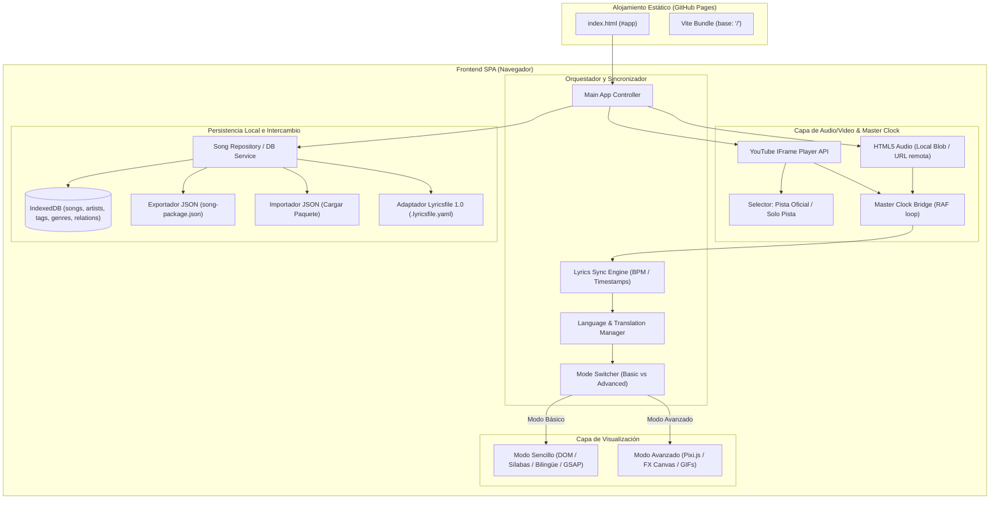
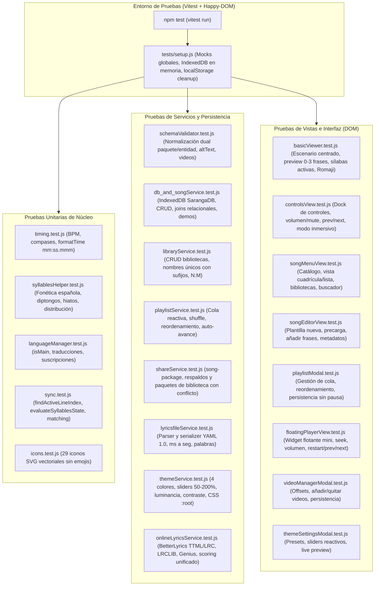

# Diseño Técnico y Arquitectura: SarangaBaranga (`proy-letras`)

> **Arquitectura del Sistema y Patrones de Software**  
> **Versión:** 2.8.0  
> **Plataforma:** SPA Estática (GitHub Pages / `usuario.github.io`) + Persistencia Local en Navegador (IndexedDB), Sistema de Bibliotecas y Playlists, Intercambio JSON & Compatibilidad con Estándar Abierto `lyricsfile` (.lyricsfile.yaml)

---

## 1. Visión General de la Arquitectura

**SarangaBaranga** opera como una aplicación web sin servidor propio (*Zero-Backend Architecture*), diseñada para compilarse como un conjunto de archivos estáticos (HTML, JS, CSS) compatibles con **GitHub Pages**.

La persistencia de datos y el catálogo de canciones se gestiona primariamente **en el navegador del usuario mediante IndexedDB**, implementando un modelo relacional estructurado (`artists`, `songs`, `tags`, `genres`, `song_tags`, `song_genres`) con campos JSON para configuraciones temporales, visuales y de letras multilingües (`lyrics_data`, `visuals_data`).

Para permitir compartir creaciones e interoperar con fuentes externas sin requerir login ni backend de validación de subidas:
1. **Exportación / Importación JSON:** Los usuarios pueden exportar sus canciones a archivos JSON portables (`song-package.json`) y compartirlos. Al importar un archivo, el sistema lo valida y lo almacena localmente en IndexedDB.
2. **Compatibilidad con Estándar `lyricsfile` (YAML):** Soporte nativo para importar y exportar archivos en formato abierto `.lyricsfile.yaml` ([especificación 1.0](https://github.com/tranxuanthang/lyricsfile/blob/main/SPECIFICATION.md)), permitiendo cargar canciones o traducciones desde repositorios comunitarios de letras.
3. **Especificaciones y Tareas Modulares (`specs/NNNN-*`):** Toda especificación funcional, desglose de tareas y planes futuros se encuentran modularizados en carpetas individuales bajo [`specs/`](file:///home/hezztia/Documents/SarangaBaranga/specs/).
4. **Importación Directa desde YouTube / YouTube Music (Sin API Keys):** Creación autónoma de canciones desde videos individuales o listas de reproducción (`playlist?list=...`) sin requerir claves de API ni backend (`src/services/youtubeImportService.js`), apoyándose en el servicio público oEmbed y en la YouTube IFrame API (`cuePlaylist`), permitiendo poblar canciones vacías (sin letras) para reproducción inmediata o posterior edición.

El audio se reproduce principalmente a través de la **YouTube IFrame Player API** (video oficial y solo pista) o mediante elementos de audio HTML5 para archivos locales/remotos.



---

## 2. Separación de Datos: Esquema Modular, Persistencia Local e Intercambio

Los datos de cada canción se desacoplan en **tres estructuras conceptuales**, facilitando tanto su almacenamiento relacional estructurado en el navegador (IndexedDB) como su exportación e importación en archivos JSON individuales o empaquetados:

### 2.1. `metadata` (Información General y Clasificación)
* **En Base de Datos Local:** Se distribuye entre el almacén relacional `songs` (`title`, `audio_path`), el almacén `artists` (`artist_id`) y los almacenes de relación `song_tags` y `song_genres`.
* **Estructura en Archivo (`metadata.json`):**
```json
{
  "title": "Nombre de la Canción",
  "artist": "Artista o Banda",
  "genres": ["Rock", "Pop"],
  "tags": ["acústico", "karaoke"],
  "audioPath": "songs/pista_demo.mp3",
  "videos": [
    {
      "id": "vid-1",
      "name": "Video Oficial",
      "url": "https://www.youtube.com/watch?v=abc123xyz",
      "offset": 0
    },
    {
      "id": "vid-2",
      "name": "Versión Karaoke con Intro",
      "url": "https://www.youtube.com/watch?v=inst123xyz",
      "offset": 12.5
    }
  ],
  "youtubeUrlFull": "https://www.youtube.com/watch?v=abc123xyz",
  "youtubeUrlInstrumental": "https://www.youtube.com/watch?v=inst123xyz"
}
```

### 2.2. `basic` (Letra Multilingüe, Traducciones, Sílabas y Estilo) -> `songs.lyrics_data`
* **En Base de Datos Local:** Se almacena como objeto en el campo `lyrics_data` del registro en `songs`.
* **Soporte de Traducciones:** Soporta un número ilimitado de idiomas en el arreglo `languages`. Un único idioma está señalado con `isMain: true` (idioma original de la canción) y todos los demás con `isMain: false` (traducciones).
* **Estructura en Archivo (`basic.json` / `lyrics_data`):**
```json
{
  "timing": {
    "bpm": 120,
    "timeSignature": [4, 4],
    "syncMode": "timestamp" // "timestamp" (segundos) o "beat" (compases)
  },
  "styles": {
    "textColor": "#A0A0A0",
    "activeColor": "#FFD700",
    "translationColor": "#38BDF8",
    "backgroundColor": "#121212",
    "fontFamily": "system-ui, sans-serif",
    "fontSize": "2.2rem"
  },
  "youtube": {
    "full": "https://www.youtube.com/watch?v=abc123xyz",
    "instrumental": "https://www.youtube.com/watch?v=inst123xyz"
  },
  "customTheme": {
    "bgColor": "#0d1117",
    "panelBg": "#161b22",
    "primaryColor": "#58a6ff",
    "textMain": "#c9d1d9",
    "lyricsScale": 1.1,
    "translationScale": 1.0,
    "altScale": 1.0,
    "originalColor": "#f0f6fc",
    "activeColor": "#58a6ff",
    "completedColor": "#8b949e",
    "translationColor": "#79c0ff",
    "altColor": "#d2a8ff",
    "activeGlow": true
  },
  "languages": [
    {
      "code": "es",
      "name": "Español (Original)",
      "isMain": true,
      "plain": "Caminando por la ciudad\nBajo la luz del sol",
      "lines": [
        {
          "id": "line-es-1",
          "startTime": 10.5,
          "endTime": 14.0,
          "text": "Caminando por la ciudad",
          "syllables": [
            { "text": "Ca", "startTime": 10.5, "duration": 0.4 },
            { "text": "mi", "startTime": 10.9, "duration": 0.3 },
            { "text": "nan", "startTime": 11.2, "duration": 0.5 },
            { "text": "do ", "startTime": 11.7, "duration": 0.5 },
            { "text": "por ", "startTime": 12.3, "duration": 0.4 },
            { "text": "la ", "startTime": 12.8, "duration": 0.3 },
            { "text": "ciu", "startTime": 13.1, "duration": 0.4 },
            { "text": "dad", "startTime": 13.5, "duration": 0.5 }
          ]
        }
      ]
    },
    {
      "code": "en",
      "name": "English (Translation)",
      "isMain": false,
      "plain": "Walking through the city\nUnder the sunlight",
      "lines": [
        {
          "id": "line-en-1",
          "startTime": 10.5,
          "endTime": 14.0,
          "text": "Walking through the city",
          "syllables": [
            { "text": "Wal", "startTime": 10.5, "duration": 0.5 },
            { "text": "king ", "startTime": 11.0, "duration": 0.4 },
            { "text": "through ", "startTime": 11.4, "duration": 0.5 },
            { "text": "the ", "startTime": 11.9, "duration": 0.4 },
            { "text": "ci", "startTime": 12.3, "duration": 0.5 },
            { "text": "ty", "startTime": 12.8, "duration": 0.7 }
          ]
        }
      ]
    }
  ]
}
```

* **Reglas del Modelo Multilingüe:**
  1. **Unicidad del Idioma Principal:** Exactamente una pista lingüística debe tener `isMain: true`. Representa la versión cantada por el artista.
  2. **Traducciones Ilimitadas:** Cualquier número de pistas con `isMain: false`. Cada una mapea su contenido a timestamps de audio para visualización independiente o subtitulado simultáneo.
  3. **Retrocompatibilidad Automática:** Si un archivo JSON o registro previo contiene un arreglo `lines` directamente en la raíz de `lyrics_data` (esquema mono-idioma antiguo), el cargador de la aplicación lo migra en memoria al esquema multilingüe asignándolo a `{ code: 'und', name: 'Original', isMain: true, lines }`.

### 2.3. `advanced` (Efectos de GSAP y PixiJS) -> `songs.visuals_data`
* **En Base de Datos Local:** Se almacena como objeto en el campo `visuals_data` del registro en `songs`.
* **Estructura en Archivo (`advanced.json` / `visuals_data`):**
```json
{
  "enabled": true,
  "effects": [
    {
      "id": "fx-1",
      "triggerTime": 10.5,
      "type": "bgColorTransition",
      "params": { "toColor": "#1E1B4B", "duration": 1.2 }
    },
    {
      "id": "fx-2",
      "triggerTime": 25.0,
      "type": "shapeBurst",
      "params": { "shape": "stars", "count": 25, "palette": ["#FF007A", "#7928CA"] }
    },
    {
      "id": "fx-3",
      "triggerTime": 42.0,
      "type": "imageGifOverlay",
      "params": { "url": "https://media.giphy.com/media/...", "duration": 5.0, "position": "center" }
    }
  ]
}
```

### 2.4. Paquete de Canción Unificado (`song-package.json`)
Para compartir canciones entre usuarios sin depender de un servidor central, una canción completa se exporta e importa como un único objeto JSON que empaqueta todas las capas con sus múltiples idiomas:
```json
{
  "version": "1.1.0",
  "metadata": { ... },
  "basic": { ... }, // Incluye languages: [ principal, traducciones... ]
  "advanced": { ... }
}
```

### 2.5. Especificación y Compatibilidad con el Estándar Abierto `lyricsfile` (tranxuanthang/lyricsfile 1.0)

Para asegurar la máxima interoperabilidad con el ecosistema comunitario y reproductores modernos de letras sincronizadas, SarangaBaranga implementa compatibilidad nativa con la especificación abierta **Lyricsfile 1.0** ([tranxuanthang/lyricsfile](https://github.com/tranxuanthang/lyricsfile/blob/main/SPECIFICATION.md)).

#### 2.5.1. Estructura de un Archivo `.lyricsfile.yaml`
```yaml
version: '1.0'

metadata:
  title: 'Caminando por la ciudad'
  artist: 'Artista Ejemplo'
  language: 'es' # Código ISO 639-1
  duration_ms: 180000
  instrumental: false

lines:
  - text: 'Caminando por la ciudad'
    start_ms: 10500
    end_ms: 14000
    words:
      - text: 'Caminando '
        start_ms: 10500
        end_ms: 12300
      - text: 'por '
        start_ms: 12300
        end_ms: 12800
      - text: 'la '
        start_ms: 12800
        end_ms: 13100
      - text: 'ciudad'
        start_ms: 13100
        end_ms: 14000

plain: |
  Caminando por la ciudad
```

#### 2.5.2. Mapeo Bidireccional entre `lyricsfile` y SarangaBaranga

| Entidad / Campo `lyricsfile` 1.0 | Modelo Interno SarangaBaranga | Regla de Transformación y Normalización |
| :--- | :--- | :--- |
| `version` | String (`"1.0"`) | Verificación de versión compatible. |
| `metadata.title` | `songs.title` / `metadata.title` | Mapeo directo de título. |
| `metadata.artist` | `artists.name` / `metadata.artist` | Búsqueda o creación (*upsert*) del artista en IndexedDB. |
| `metadata.language` | `languages[i].code` | Código ISO 639-1 (`'es'`, `'en'`, `'ja'`, etc.). |
| `metadata.instrumental` | `songs.lyrics_data.instrumental` | Si es `true`, la pista omite renderizado de versos. |
| `metadata.offset_ms` | `timing.globalOffset` | Offset global en milisegundos (`offset_ms / 1000`). |
| `lines[i].text` | `lines[i].text` | Texto completo del verso. |
| `lines[i].start_ms` | `lines[i].startTime` | Conversión: `start_ms / 1000` (segundos flotantes). |
| `lines[i].end_ms` | `lines[i].endTime` | Conversión: `end_ms / 1000` (segundos flotantes). |
| `words[j].text` | `syllables[j].text` | Preservación de espacios para reconstruir exactamente la línea. |
| `words[j].start_ms` | `syllables[j].startTime` | Conversión: `start_ms / 1000`. |
| `words[j].end_ms` | `syllables[j].duration` | Duración calculada: `(end_ms - start_ms) / 1000`. |
| `plain` | `languages[i].plain` | Cadena multilínea de letra pura sin sincronización. |

#### 2.5.3. Flujos de Trabajo con `lyricsfile`
1. **Importar como Nueva Canción:** Un archivo `.lyricsfile.yaml` se procesa extrayendo metadata y asignando su contenido como el idioma principal (`isMain: true`) de la nueva canción.
2. **Importar como Traducción a Canción Existente:** El usuario puede seleccionar una canción en su biblioteca y ejecutar "Añadir traducción desde archivo Lyricsfile". El sistema parsea el YAML, detecta el código `language` e inserta una nueva pista en `languages` con `isMain: false`.
3. **Exportar a `lyricsfile`:** En el visor o editor, el usuario puede seleccionar cualquier pista de idioma (la original o una traducción) y exportarla como un archivo `.lyricsfile.yaml` válido para su uso en plataformas externas.

---

## 3. Modelo de Persistencia Local (IndexedDB) y Esquema de Datos

Para evitar la complejidad de autenticación de usuarios y verificación de subidas en un backend, la base de datos se ejecuta directamente en el navegador del cliente utilizando **IndexedDB**. 

Se mantiene de manera idéntica la estructura de entidades relacionales diseñada (`artists`, `songs`, `tags`, `genres`, `song_tags`, `song_genres`), garantizando integridad y modularidad.

### 3.1. Almacenes de Objetos en IndexedDB (`SarangaDB`)
* **`artists`**: `{ id: string | number, name: string }` (KeyPath: `id`, Index: `name`)
* **`songs`**: `{ id: string | number, title: string, artist_id: string | number, audio_path: string, lyrics_data: object, visuals_data: object, created_at: string }` (KeyPath: `id`, Index: `title`, `artist_id`)
* **`tags`**: `{ id: string | number, name: string }` (KeyPath: `id`, Index: `name`)
* **`genres`**: `{ id: string | number, name: string }` (KeyPath: `id`, Index: `name`)
* **`song_tags`**: `{ song_id: string | number, tag_id: string | number }` (Index: `song_id`, `tag_id`, KeyPath compuesto o autoincremental)
* **`song_genres`**: `{ song_id: string | number, genre_id: string | number }` (Index: `song_id`, `genre_id`, KeyPath compuesto o autoincremental)
* **`libraries`**: `{ id: number, name: string, description: string, created_at: string }` (KeyPath: `id`, Index: `name`, `created_at`)
* **`song_libraries`**: `{ id: number, song_id: number, library_id: number, added_at: string }` (Index: `song_id`, `library_id`, Index compuesto `song_library: [song_id, library_id]`)
* **`settings`**: `{ key: string, value: any }` (KeyPath: `key`)

### 3.2. Esquema Relacional Canónico de Referencia (SQL)
Este esquema SQL define la fuente de verdad conceptual del modelo de datos:

```sql
-- 1. Tabla de artistas
CREATE TABLE artist (
	id BIGINT PRIMARY KEY GENERATED ALWAYS AS IDENTITY,
	name VARCHAR(255) NOT NULL
);

-- 2. Tabla principal de canciones
CREATE TABLE song (
	id BIGINT PRIMARY KEY GENERATED ALWAYS AS IDENTITY,
	created_at TIMESTAMPTZ DEFAULT NOW(),
	title VARCHAR(255) NOT NULL,
	artist_id BIGINT REFERENCES artists(id),
	audio_path VARCHAR(512), -- Ruta de archivo de audio o URL
	lyrics_data JSONB,       -- Estructura JSON con las marcas de tiempo (modo básico)
	visuals_data JSONB       -- Estructura JSON con los efectos de GSAP y PixiJS (modo avanzado)
);

-- 3. Tablas de categorización
CREATE TABLE tag (
	id BIGINT PRIMARY KEY GENERATED ALWAYS AS IDENTITY,
	name VARCHAR(255) NOT NULL
);

CREATE TABLE genre (
	id BIGINT PRIMARY KEY GENERATED ALWAYS AS IDENTITY,
	name VARCHAR(255) NOT NULL
);

-- 4. Tablas intermedias para relaciones N:M
CREATE TABLE song_tags (
	song_id BIGINT REFERENCES songs(id) ON DELETE CASCADE,
	tag_id BIGINT REFERENCES tags(id) ON DELETE CASCADE,
	PRIMARY KEY (song_id, tag_id)
);

CREATE TABLE song_genres (
	song_id BIGINT REFERENCES songs(id) ON DELETE CASCADE,
	genre_id BIGINT REFERENCES genres(id) ON DELETE CASCADE,
	PRIMARY KEY (song_id, genre_id)
);
```

### 3.3. Capa de Servicios Locales: `src/services/db.js`, `src/services/songService.js` y `src/services/libraryService.js`
La aplicación utiliza un servicio de base de datos local basado en IndexedDB (`SarangaDB`, versión 3 con almacenes `songs`, `artists`, `tags`, `genres`, `song_tags`, `song_genres`, `libraries`, `song_libraries` y `settings`). En la primera visita del usuario, se inicializan automáticamente las canciones por defecto ("Still Alive" e "Idol" desde `still_alive.json` y `yoasobi_idol.json`), marcando el sembrado de forma dual en `localStorage` y en el almacén `settings`. Esta persistencia garantiza que si el usuario decide eliminar alguna de las canciones, el sistema respeta la acción y nunca vuelve a reinsertarlas automáticamente en visitas o recargas posteriores.

La capa de repositorio expone funciones asíncronas limpias con resolución de relaciones (joins lógicos):

```javascript
// src/services/songService.js
import { getDB } from './db.js'

export async function fetchSongById(songId) {
  const db = await getDB()
  const song = await db.get('songs', songId)
  if (!song) return null

  const artist = song.artist_id ? await db.get('artists', song.artist_id) : null
  const tagRelations = await db.getAllFromIndex('song_tags', 'song_id', songId)
  const tags = await Promise.all(tagRelations.map(rel => db.get('tags', rel.tag_id)))

  const genreRelations = await db.getAllFromIndex('song_genres', 'song_id', songId)
  const genres = await Promise.all(genreRelations.map(rel => db.get('genres', rel.genre_id)))

  return {
    ...song,
    artist,
    tags: tags.filter(Boolean),
    genres: genres.filter(Boolean)
  }
}
```

#### 3.3.1. Servicio de Bibliotecas y Agrupaciones (`src/services/libraryService.js`)
* **Modelo N:M Autónomo:** Las bibliotecas permiten a los usuarios organizar y categorizar sus canciones en múltiples grupos personalizados sin duplicar el almacenamiento físico del archivo ni los datos temporales.
* **Operaciones Principales:**
  * `createLibrary(name, description)`: Crea una nueva agrupación validando que el nombre no esté vacío.
  * `listLibraries()`: Obtiene todas las bibliotecas calculando de forma reactiva el recuento de canciones en cada una (`songCount`).
  * `renameLibrary(id, newName)`: Modifica el nombre o descripción de la biblioteca seleccionada.
  * `deleteLibrary(id)`: Elimina la biblioteca y sus relaciones en `song_libraries` preservando intactas las canciones del catálogo general.
  * `setSongLibraries(songId, libraryIds)` / `addSongToLibrary(songId, libraryId)` / `removeSongFromLibrary(songId, libraryId)`: Gestión de relaciones de pertenencia.
  * `getNextUniqueLibraryName(baseName, existingNames)`: Algoritmo que calcula nombres únicos progresivos con sufijo `(2)`, `(3)`, etc., garantizando la no colisión durante la importación.

### 3.4. Motor de Exportación e Importación JSON (`src/services/shareService.js`)
* **`exportSongPackage(songId)`**: Recupera la canción con su artista, tags y géneros, construye el paquete `song-package.json` con todas sus pistas lingüísticas y desencadena la descarga en el navegador con `Blob` y enlace dinámico.
* **`importSongPackage(jsonFileOrString)`**: Parsea el archivo, valida su esquema, realiza *upsert* de artista, géneros y tags, inserta la canción y sus relaciones en IndexedDB y retorna el nuevo ID para su reproducción o edición inmediata.
* **`exportLibraryPackage(libraryId)`**: Empaqueta una biblioteca específica con todas sus canciones asociadas en un archivo `saranga-library-package` (`biblioteca-<nombre>.json`), facilitando compartir colecciones temáticas completas sin transferir todo el catálogo.
* **`importLibraryPackage(fileOrString, { onConflictChoice })`**: Importa una biblioteca compartida. Si la biblioteca no existe, la crea automáticamente. Si ya existe una con el mismo nombre, solicita resolución al usuario:
  * **Combinar:** Añade las canciones del paquete a la biblioteca existente.
  * **Crear nueva:** Crea una nueva biblioteca con sufijo secuencial `(2)`, `(3)`, etc., y le asigna las canciones importadas.
* **`exportLibraryBackup()` / `importLibraryBackup()`**: Permite realizar un volcado completo de toda la base de datos local para respaldos o migración de navegador.

### 3.5. Servicio Adaptador para Estándar `lyricsfile` (`src/services/lyricsfileService.js`)
Servicio especializado en la interoperabilidad con la especificación abierta YAML 1.0 ([tranxuanthang/lyricsfile](https://github.com/tranxuanthang/lyricsfile/blob/main/SPECIFICATION.md)):
* **`parseLyricsfile(yamlString)`**: Parsea con seguridad el documento YAML, valida versión `"1.0"`, convierte `start_ms` y `end_ms` a segundos decimales y genera la estructura interna de `lines` y `syllables`.
* **`exportLanguageToLyricsfile(song, languageCode)`**: Extrae la pista solicitada (o el idioma principal `isMain: true` por defecto), normaliza los tiempos a milisegundos enteros, reconstruye el bloque `words` y `plain`, y descarga un archivo `.lyricsfile.yaml`.
* **`importLyricsfileAsTranslation(songId, yamlString)`**: Agrega el archivo parseado como una nueva traducción (`isMain: false`) en el arreglo `languages` de una canción existente.
* **`importLyricsfileAsNewSong(yamlString)`**: Crea una nueva canción en la base de datos local usando la metadata del archivo y estableciendo su letra como el idioma principal (`isMain: true`).

### 3.6. Integración con la API de Letras y Traducciones: BetterLyrics & Unison (`src/services/betterLyricsService.js`)
Para acelerar la creación de canciones y facilitar el acceso a miles de letras sincronizadas con traducciones, SarangaBaranga se integra con el ecosistema abierto de **BetterLyrics** y **Unison** (`unison.boidu.dev` / `api.betterlyrics.org`):
* **Búsqueda Abierta en Tiempo Real:** Consulta sin requerimiento de API key a `GET https://unison.boidu.dev/lyrics/search?q={query}`, retornando resultados clasificados con título, artista, duración, `videoId` de YouTube y tipo de sincronización (`richsync` por sílabas vs `linesync` por versos).
* **Carga de Letras en Formato TTML (Timed Text Markup Language):**
  * Obtención del documento TTML mediante `GET https://unison.boidu.dev/lyrics/:id` (con fallback a `https://api.betterlyrics.org/getLyrics?s=...&a=...`).
  * Parser nativo mediante `DOMParser` del navegador que extrae versos (`<p begin="..." end="...">`) y sílabas/palabras (`<span begin="..." end="...">texto</span>`).
  * Conversión de marcas temporales (`M:SS.mmm` / `H:MM:SS.mmm` / `SS.mmm`) a segundos decimales con precisión de milisegundos.
* **Sincronización Automática para Fuentes LRC o Línea a Línea:** Si la canción solo cuenta con marcas de tiempo por frase (`linesync`), el servicio ejecuta automáticamente el motor fonético de silabeo (`src/lyrics/syllablesHelper.js`), distribuyendo proporcionalmente las sílabas dentro del intervalo `[startTime, endTime]`.
* **Traducción Automática Multilingüe:**
  * Integración con el endpoint de traducción de Unison (`POST https://unison.boidu.dev/translate`), que traduce los versos al idioma solicitado (ej. español `es`) y provee romanización fonética.
  * Creación automática de la pestaña de traducción en `lyrics_data.languages` (`isMain: false`), dejando la canción preparada para el subtitulado bilingüe simultáneo.
* **Motor de Búsqueda Multi-Modo y Filtro Estricto:**
  * **Modo General:** Búsqueda libre por cualquier término o detección automática de videoId/URL de YouTube.
  * **Modo Solo por Artista:** Consulta la base de datos de Unison y aplica un algoritmo de filtrado estricto (`isArtistMatch`) que descarta falsos positivos (canciones de otros artistas que contienen la palabra en el título, ej. "Queen & Poet"), admitiendo únicamente temas interpretados por el artista objetivo o sus colaboraciones directas (`feat.`, `ft.`, `&`, `with`, `x`, `vs.`).
  * **Modo Artista y Título:** Consulta dual con endpoint de búsqueda exacta (`GET /lyrics/search?song=...&artist=...`) y fallback inteligente clasificado, situando en primera posición la coincidencia combinada.
  * **Modo Video / Enlace YouTube:** Consulta directa a `GET /lyrics?v=...` y `GET /lyrics/variants/...` para traer la sincronización comunitaria oficial y sus variantes registradas para ese video musical.
  * **Filtros de Sincronización:** Posibilidad de discriminar entre canciones con sincronización sílaba a sílaba (`richsync` / TTML) o por versos completos (`linesync` / LRC).
* **Flujo Precargado Hacia el Editor (`songEditorView`):** Al seleccionar un tema en el modal de búsqueda, se ensambla un objeto de canción completo y se transfiere a `songEditorView.open(preconfiguredSong)`, abriendo el editor con metadatos, video de YouTube, versos, sílabas y traducción ya colocados, listos para ajuste fino y guardado local en IndexedDB.

### 3.7. Arquitectura de Búsqueda Online Multi-Motor: BetterLyrics, LRC.red, Genius.com y LRCLIB (`src/services/onlineLyricsService.js`)
Para ampliar radicalmente la disponibilidad de canciones sin depender de un único proveedor, SarangaBaranga implementa una arquitectura desacoplada y extensible de búsqueda multi-motor:
1. **Pestaña "Todas las Fuentes" (Búsqueda Simultánea Unificada con Límite de 6 por Fuente):**
   * Una única barra de búsqueda consulta en paralelo (`Promise.allSettled`) a BetterLyrics, LRC.red, LRCLIB y Genius.com.
   * **Límite de Resultados por Fuente:** Para garantizar un balance homogéneo y evitar que un solo proveedor acapare la lista, se limita a un **máximo estricto de 6 resultados por fuente** en la búsqueda general (`slice(0, 6)` por proveedor). En contraste, las búsquedas por proveedor individual mantienen su límite completo sin restricción.
   * **Algoritmo de Clasificación y Scoring:** Los resultados unificados se ordenan heurísticamente según su fidelidad técnica:
     1. Canciones con sincronización silábica TTML (`richsync` de BetterLyrics o LRC.red): mayor prioridad para canto guiado.
     2. Canciones con sincronización por versos LRC (`linesync` de BetterLyrics, LRC.red o LRCLIB).
     3. Canciones con letra plana (Genius o LRCLIB).
     4. Bonificaciones adicionales por disponibilidad de video oficial de YouTube y arte de carátula (`artwork`).
2. **Servicio LRC.red (`src/services/lrcRedService.js`):**
   * Integración con la plataforma comunitaria abierta LRC.red (`https://lrc.red/search.json?q=...`), con catálogo de 29.8 millones de canciones y soporte nativo de CORS libre de tokens.
   * Recuperación de detalles y archivos de sincronización a través de `/s/{isrc}.json`, con descarga directa en formatos TTML silábico, Lyricsfile YAML 1.0 y LRC.
3. **Servicio LRCLIB (`src/services/lrclibService.js`):**
   * Integración con la API comunitaria abierta de LRCLIB (`https://lrclib.net/api/search`).
   * Libre de autenticación o tokens y con soporte CORS nativo en el navegador.
   * Parser automático de marcas temporales LRC (`[mm:ss.xx]`) a segundos y distribución fonética proporcional de sílabas (`src/lyrics/syllablesHelper.js`).
4. **Servicio Genius.com (`src/services/geniusService.js`):**
   * Conexión con `https://api.genius.com/search` (con soporte CORS nativo con Bearer token).
   * Almacenamiento seguro del Client Access Token en `localStorage` (`saranga_genius_token`) o variable de entorno (`VITE_GENIUS_ACCESS_TOKEN`).
   * Cascada resiliente de obtención de letras (LRCLIB track/artist match -> Lyrics.ovh -> líneas de texto) para asegurar la carga completa de versos al 100%.
5. **Modal Unificado (`src/views/onlineLyricsModal.js`):**
   * Pestañas superiores para alternar entre "Todas las Fuentes" y vistas especializadas por motor.
   * Al conmutar a **BetterLyrics**, se habilitan sus 4 modos exclusivos (*General*, *Solo por Artista* con filtro estricto, *Artista y Título*, y *Enlace / Video YouTube*) y filtros de sincronización.
   * Al conmutar a **LRC.red**, se ofrecen modos de Búsqueda General y Artista + Canción, con filtros de sincronización.
   * Al conmutar a **Genius**, se habilita la barra de configuración de token y los campos duales de Artista y Título.
   * Al conmutar a **LRCLIB**, se ofrecen búsquedas generales o por Artista y Canción.
   * Badges distintivos por color de proveedor (`.badge-source-betterlyrics`, `.badge-source-lrcred`, `.badge-source-genius`, `.badge-source-lrclib`), miniaturas de carátula (`.result-card-artwork`) y traducción automática en vivo mediante Unison.
   * **Arquitectura de Layout Adaptativo de Búsqueda (`layout-scroll-controls` vs `layout-fixed-controls`):**
     * En pantallas de escritorio estándar (PC con espacio vertical amplio $\ge 260\text{px}$ para resultados), los controles de búsqueda y pestañas permanecen fijos (*quietos*) en la parte superior (`.layout-fixed-controls`), scrolleando únicamente la lista interna de resultados.
     * En teléfonos móviles ($\le 768\text{px}$) o cuando la ventana de resultados es reducida ($< 260\text{px}$ de altura útil por ventanas pequeñas en PC o apaisado móvil), el modal activa automáticamente `.layout-scroll-controls`. Todo el cuerpo del modal scrollea al unísono, permitiendo que los botones y campos de búsqueda sigan el desplazamiento hacia arriba y cedan el 100% de la altura de la pantalla a los resultados.
     * **Botón Flotante de Retorno a la Búsqueda ("Subir" / `#btn-online-scroll-top`):** Al descender en la lista de resultados ($> 70\text{px}$ de scroll), se visualiza un botón flotante con icono `iconChevronUp` que permite con un solo toque volver suavemente a la parte superior (`modalBody.scrollTo({ top: 0, behavior: 'smooth' })`) y enfocar el campo de búsqueda activo.
   * Al seleccionar una canción, se genera el paquete normalizado y se entrega al editor (`songEditorView.open(songPackage)`) con todos los versos, sílabas y metadatos preconfigurados.

---

## 4. Master Clock y Reproducción

La aplicación admite dos orígenes de audio bajo el mismo contrato de **Reloj Maestro**:

1. **YouTube IFrame API con Soporte Universal (YouTube & YouTube Music):**
   * **Compatibilidad Extensa de URLs:** Soporte para enlaces directos de `https://music.youtube.com/watch?v=...`, `https://www.youtube.com/watch?v=...`, `https://youtu.be/...`, shorts (`/shorts/...`), embed (`/embed/...`) y parámetros adicionales (`&si=`, `&list=`). El parser extrae limpiamente el identificador único de 11 caracteres.
   * **Audio Invisible:** El reproductor IFrame de YouTube se inicializa de forma **invisible** (`position: fixed; top: -9999px; left: -9999px; opacity: 0; pointer-events: none;`) para garantizar que no se renderice en pantalla pero continúe reproduciendo audio fielmente.
   * **Múltiples Videos con Offset:** Cada video asociado cuenta con un `offset` en segundos que define la marca temporal del video donde comienza a cantarse la letra.
   * **Fórmula de Sincronización:** El tiempo efectivo de la letra se calcula como:  
     $$\tau_{\text{letra}} = t_{\text{video}} - \text{video.offset}$$
   * **Búsqueda y Salto (Seek):** Al navegar a un segundo $\tau$, el reproductor salta a $\tau + \text{video.offset}$.
   * **Transferencia Fluida:** Al alternar entre distintos videos asociados, se preserva la posición de canto $\tau_{\text{letra}}$.
2. **Audio Nativo HTML5 / Archivo Local (`audio_path`):** Cuando la canción cuenta con un archivo de audio local (almacenado como Blob en IndexedDB o seleccionado mediante input file) o una URL de audio remota. El elemento `<audio>` emite eventos `timeupdate` de forma nativa o se reproduce vía Web Audio API.

### 4.1. Control Maestro de Volumen y Silenciado (Master Volume)
* **Gestión Unificada:** `mediaPlayer.js` expone `setVolume(volume)` (0 a 100) y `getVolume()`, gobernando simultáneamente tanto la YouTube IFrame API (`ytPlayer.setVolume(vol)`) como el elemento de audio HTML5 (`audioElement.volume = vol / 100`).
* **Persistencia Local:** El nivel de volumen preferido del usuario se almacena en `localStorage` (`saranga_player_volume`), manteniéndose constante entre canciones, recargas de página y sesiones.
* **Control en Barra de Controles (`controlsView.js`):** Slider interactivo estilizado (`.volume-slider`) con botón mute/unmute que conmuta entre silencio y el volumen anterior.

### 4.2. Barra de Progreso y Búsqueda Continua (Seek Slider Interaction Model)
* **Gestión de Interacción sin Congelamiento:** Para evitar que el thumb de la barra de progreso quede estático tras hacer clic o arrastrar en la línea de tiempo (problema causado por la retención persistente de foco en navegadores sobre elementos `<input type="range">`), `controlsView.js` gestiona la barra con la bandera de interacción activa `isUserSeeking`.
* **Ciclo de Eventos:** Eventos `pointerdown`, `mousedown`, `touchstart` e `input` activan `isUserSeeking = true`. Al soltar el control (`change`, `pointerup`, `mouseup`, `touchend`), se apaga la bandera y se desenfoca el elemento (`seekSlider.blur()`), permitiendo que el Master Clock continúe actualizando `seekSlider.value` en cada fotograma (`requestAnimationFrame`) de forma ininterrumpida sin necesidad de pausar.

### 4.3. Navegación Temporal por Teclado y Control de Reproducción Global
* **Atajos de Flechas (`ArrowLeft` / `ArrowRight`):** Se interceptan para navegar en la línea temporal por un salto discreto de segundos configurable (`seekStep`). Se omiten cuando el foco está sobre campos de texto editables (`<input>`, `<textarea>`, `contenteditable`).
* **Atajo Global de Barra Espaciadora (`Space`):** Permite pausar y reanudar la reproducción (`mediaPlayer.togglePlay()`) de forma universal en cualquier pantalla, menú o modal abierto (menú de canciones, modal de playlist, gestión de videos, configuración de temas, editor de canciones, popovers).
* **Detección de Contexto de Tipeo (`isTypingContext`):** Si el foco se encuentra en un campo de texto editable (`<input type="text|search|url|number">`, `<textarea>` o elemento con `contenteditable`), la barra espaciadora no interfiere ni pausa la música, permitiendo tipear espacios normalmente. Al no estar en un campo de texto, se ejecuta `preventDefault()` para evitar el desplazamiento vertical de la ventana y la pulsación accidental de botones previamente enfocados.
* **Configuración del Salto:** Selector configurable integrado en el menú de configuración de Modo Letra (`controls-settings-popover` en `controlsView.js`), con opciones de 1s, 2s, 3s, 5s, 10s, 15s y 30s (5s por defecto). Persiste en `localStorage` (`saranga_seek_step`).

### 3.8. Servicio de Traducción Automática Gratuita (Zero-Backend): Unison & MyMemory (`src/services/translationService.js`)
Para posibilitar la traducción instantánea de canciones completas y versos individuales sin costos operativos ni servidores intermediarios, SarangaBaranga implementa una arquitectura de traducción en cascada:
1. **Traducción por Lotes con Unison API (`POST https://unison.boidu.dev/translate`):** Envía las líneas con contenido en una única solicitud HTTP JSON (`{ lines: string[], to: targetLang }`), traduciendo decenas de versos de forma instantánea y detectando el idioma de origen automáticamente.
2. **Fallback Neuronal con MyMemory API (`https://api.mymemory.translated.net/get`):** Si Unison responde con error (ej. HTTP 502) o se traducen idiomas como japonés (`ja`), el servicio recurre de forma transparente a la API neuronal de MyMemory, procesando las frases en paralelo controlado (bloques de 4 líneas) con clave de cortesía para una cuota de hasta 50,000 palabras diarias gratuitas.
3. **Preservación Estricta de Pausas Instrumentales:** Las líneas en blanco o instrumentales no se envían a las APIs de traducción (evitando errores 502 y consumo innecesario de cuota) y se reinsertan vacías en sus posiciones originales exactas, blindando la sincronización de compases.
4. **Decodificación de Entidades HTML:** Saneamiento universal (`decodeHtmlEntities`) para eliminar caracteres codificados devueltos por traductores automáticos (`&#39;`, `&quot;`, `&amp;`, etc.).

En ambos orígenes de audio, el **Sincronizador de Letras** consume un único valor normalizado: `currentTime` en segundos.

---

## 5. Navegación: Menú de Selección de Canciones y Modo Letra

1. **Menú de Selección de Canciones (`songMenuView`):**
   * Pantalla inicial de bienvenida y catálogo general de canciones en IndexedDB.
   * **Modos de Vista Dual (Cuadrícula / Lista):** El usuario puede conmutar entre visualización en **Cuadrícula** (tarjetas amplias con cabecera y metadatos) y **Lista** (filas horizontales compactas tipo biblioteca multimedia), con persistencia de su preferencia en `localStorage` (`saranga_menu_view_mode`) y controles integrados en la barra de búsqueda mediante iconos SVG vectoriales (`iconGrid`, `iconList`).
   * **Acciones Principales:** Botón "Agregar canción" que abre el modal unificado `onlineLyricsModal` para buscar y precargar canciones online (BetterLyrics, Genius, LRCLIB, LRC.red). El botón para "Crear Canción" vacía se ubica como un acceso directo con estilo primario e icono '+' en la cabecera de este modal a la izquierda del botón de cierre.
   * Permite gestionar los videos asociados a cada canción mediante un modal dedicado (`videoManagerModal`), importar nuevos paquetes JSON o Lyricsfile YAML y exportar respaldos.
   * Al seleccionar una canción ("🎤 Entrar a Modo Letra" o clic directo en la tarjeta/fila), la canción se carga y se realiza la transición a la vista de letras.

2. **Modo Letra (`BasicModeViewer` / `lyricsViewport`):**
   * Pantalla dedicada a la visualización de la letra y el canto sincronizado sílaba a sílaba.
   * Incorpora acceso rápido en el encabezado (`← Menú de Canciones`), navegación directa al catálogo al hacer clic en el fondo del reproductor, y botón de pantalla completa (`#btn-controls-fullscreen`) que oculta los controles y el encabezado, disponiendo de un botón flotante para salir (`#btn-exit-fullscreen`).
   * Barra de controles con barra de progreso, botón de reproducción/pausa, selector dinámico de videos asociados con offsets, **slider interactivo de volumen y botón de silenciado**, selector de traducciones y selector de líneas siguientes (0 a 3 frases).
   * Botón directo "✏️ Editar" para ingresar a ajustar la letra de la canción activa en cualquier momento.

3. **Menú y Editor de Creación y Edición de Letras (`songEditorView`):**
   * Pantalla completa para que los usuarios creen canciones desde cero, editen canciones existentes o afinen canciones importadas desde BetterLyrics.

   * **Metadatos y Videos:** Edición de título, artista, géneros, etiquetas y lista dinámica de videos de YouTube con offsets.
   * **Asistente de Audio en Vivo:** Mini-reproductor integrado para escuchar la canción, pausar y capturar marcas de tiempo exactas en frases y sílabas mediante el botón de captura. Cuenta con un reloj en vivo de alta precisión en tiempo real (`mm:ss.mmm`) gobernado por el Master Clock (`requestAnimationFrame`), con arranque inmediato al reproducir y estilizado con números tabulares (`tabular-nums`) para evitar oscilaciones de layout.
   * **Gestión Multilingüe:** Sistema de pestañas para crear idiomas ilimitados, editar interactivamente el nombre y código ISO al hacer clic sobre el idioma actual o su botón de edición, designar el idioma principal (`isMain: true`), alternar traducciones y copiar estructuras de tiempo entre idiomas.
   * **Escritura por Frases y Tiempos:** Edición individual de versos (`startTime`, `endTime`, reordenamiento, preescucha puntual de fragmentos de audio).
   * **Campos Numéricos Limpios:** Los inputs de tiempo (`type="number"`) eliminan las flechas nativas y fondos blancos rígidos del navegador (`appearance: textfield; -webkit-appearance: none`), ofreciendo un aspecto oscuro, limpio y espacioso, manteniendo el ajuste por teclado (flechas arriba/abajo) y rueda del ratón.
   * **Tiempos por Sílabas con Ponderación Fonética:** Sub-editor con motor fonético de silabeo (`syllablesHelper.js`), división por palabras, ajuste fino de duración e inicio por sílaba y algoritmo de ponderación fonética musical inteligente (`calculateSyllableWeight` y `autoDistributeSyllables`), que ajusta proporcionalmente las duraciones según vocales, diptongos, acentos tónicos y alargamiento de final de verso (*phrase-final lengthening*).
   * **Herramientas de Borrado de Sílabas:** Controles dedicados para vaciar las sílabas de un verso individual (disponible en el encabezado de la tarjeta y en la barra de acciones rápidas de sílabas) y borrado masivo para todas las frases del idioma activo con confirmación obligatoria previa (`window.confirm`), informando el número total de versos y sílabas afectadas antes de ejecutar la acción destructiva.
   * **Importador Rápido:** Modal para pegar letras completas de corrido y calcular automáticamente versos, pausas y sílabas en segundos.
   * **Guía de Referencia de Frase Original para Traducción:** Al editar pistas secundarias (traducciones), cada tarjeta de frase presenta un banner contextual superior con la frase correspondiente del idioma principal (`mainLang.lines[lineIdx]`), mostrando texto original y alternativo/fonético (Romaji), aviso explícito de pausas instrumentales (`⏸ [Pausa / Verso en blanco]`), botón de copia rápida al verso traducido y selector en la barra de herramientas para alternar entre Ambos, Solo original, Solo alternativo o Desactivado con persistencia en `localStorage`.
   * **Traducción Automática y Gratuita (Zero-Backend):** Motor integrado mediante `src/services/translationService.js` (cascada Unison API + MyMemory API) que permite:
     - Traducir versos individuales con un clic en la tarjeta de frase (`Traducir`), conservando las marcas de tiempo y dejando la frase lista para canto o silabeo manual sin fragmentación silábica forzada.
     - Traducir la canción completa (`Traducir Toda la Canción`) desde la barra de herramientas del editor o desde el estado inicial vacío de una traducción, preservando fielmente pausas instrumentales (versos en blanco) para evitar desfasajes.
     - **Overlay Bloqueante de Progreso:** Durante traducciones completas o creación de idiomas traducidos, se activa un backdrop oscurecido y desenfocado con un cuadro de diálogo centrado (`translation-loading-dialog`) que previene manipulaciones erróneas del usuario mientras se procesa la solicitud.
     - Opción de traducción automática al dar de alta un nuevo idioma ("Traducir automáticamente todas las frases desde el original") en el modal de idiomas.


    * **Transición Continua y Adaptación al Estado de Reproducción:** Al abrir el editor desde Modo Letra o Menú para editar la canción activa, el flujo de reproducción no se interrumpe ni se pausa (`mediaPlayer.pause()` omitido y recarga de pista prevenida). El editor adapta inmediatamente sus controles al estado activo: botón de reproducción con icono de pausa, reloj de asistente en vivo (`mm:ss.mmm`), slider posicionado en el tiempo actual, expansión automática de la frase en canto y scroll centrado hacia ella.

### 5.1. Modo Sencillo / Básico (`BasicModeViewer`)
* **Datos fuente:** `songs.lyrics_data` (con soporte para colección `languages`).
* **Regla del Idioma Original:** La letra cantada principal siempre corresponde al idioma original de la canción (`isMain: true`). No se reemplaza por traducciones.
* **Gestión de Traducciones Opcionales:**
  * El usuario dispone de un selector dedicado en la barra de controles para activar o desactivar la traducción ("(Sin traducción)" o cualquiera de las pistas secundarias con `isMain: false`).
  * Si se selecciona una traducción, el texto traducido aparece inmediatamente debajo de la frase original con estilo en cursiva (`font-style: italic`) y color secundario (`--translation-color`).
* **Escenario Centrado con Letras Sueltas (Sin Cajas ni Fondos):**
  * **Filosofía de Letra Suelta:** Las frases no están encerradas en contenedores con bordes ni fondos opacos; flotan directamente sobre el escenario oscuro de la aplicación (`background: transparent; border: none;`), maximizando la inmersión del usuario.
  * **Frase Actual:** Se ubica permanentemente en el centro vertical y horizontal del visor con tamaño completo (`--lyrics-font-size`) y peso tipográfico destacado (700).
  * **Frases Siguientes (Debajo):** Se muestran debajo de la frase actual, reducidas al 70% del tamaño (`calc(var(--lyrics-font-size) * 0.70)`), con colores más apagados/atenuados (`--text-muted`, `--text-inactive`). El usuario puede configurar mediante selector si desea ocultar las frases siguientes (0 frases / *Ninguna (solo actual)*) o previsualizar 1, 2 o 3 frases siguientes. En el modo de 0 frases, el contenedor inferior se omite por completo, manteniendo la frase actual perfectamente centrada en el escenario.
  * **Interacción Rápida:** Al hacer clic sobre cualquier frase siguiente en previsualización, el reproductor salta instantáneamente a su tiempo de inicio (`startTime`).
* **Resaltado Sílaba a Sílaba / Palabra por Palabra sin Espacios Extra:**
  * Descompone los versos activos en elementos `<span>` continuos e inline (`display: inline; white-space: pre-wrap;`) concatenados de forma contigua (`join('')`), eliminando saltos de línea intermedios y evitando la inserción de espacios espurios en el DOM.
  * Sin transformaciones de escala artificiales (`transform: scale` removido de `.syllable.is-active-syl`), garantizando que la tipografía y el espaciado original permanezcan fidedignos y que únicamente se resalten con color de acento (`--text-active`) y brillo (`text-shadow`).
* **Preservación y Alineación de Espacios en Letras Alternativas (Romaji / altText):**
  * Para garantizar que la frase que se está cantando en ese momento (`isCurrent = true`) mantenga exactamente la misma estructura de palabras y espacios que las frases siguientes (`upcoming`), `basicViewer.js` ejecuta `getSyllableAltTextsWithSpacing(line)`.
  * Este algoritmo alinea la secuencia silábica con `line.altText`, restaurando con precisión milimétrica los espacios intermedios y puntuaciones entre palabras (`white-space: pre-wrap;`), erradicando cualquier aglutinación fonética (ej. `muteki noegaodearasumedia` se transforma fielmente en `muteki no egao de arasu media`) y sincronizando el brillo activo de canto de cada segmento sin alterar la separación tipográfica.
* **Consumo de recursos:** Extremadamente bajo, optimizado para cualquier dispositivo móvil o de escritorio sin sobrecarga gráfica.

### 5.2. Modo Avanzado (`AdvancedModeViewer`)
* **Datos fuente:** `songs.visuals_data` + `songs.lyrics_data`.
* **Renderizado:**
  * Conserva la letra y el soporte multilingüe del modo básico.
  * Monta un canvas de [`pixi.js`](file:///home/hezztia/Documents/SarangaBaranga/package.json#L17) en el fondo.
  * Un despachador de eventos lee `visuals_data.effects` y ejecuta transiciones de color, partículas, geometrías o inserción de GIFs según los timestamps musicales.

---

## 6. Despliegue en GitHub Pages (`usuario.github.io`) y Pipeline CI/CD

1. **Configuración de Vite:** Configurar `base: '/'` en [`vite.config.js`](file:///home/hezztia/Documents/SarangaBaranga/vite.config.js) dado que el repositorio corresponde a la página de usuario raíz (`LeaMesi.github.io`), la cual se sirve directamente desde la raíz del dominio (`https://leamesi.github.io/`).
2. **Dependencias y Scripts de Despliegue en `package.json`:**
   * Dependencia de desarrollo: `gh-pages` (`^6.3.0`).
   * `"predeploy": "npm run build"`: Compila la aplicación y genera los activos optimizados en `dist/`.
   * `"deploy": "gh-pages -d dist"`: Despliegue manual directo a la rama `gh-pages`.
3. **Automatización de Despliegue Continuo (CI/CD con GitHub Actions):**
   * Flujo de trabajo en `.github/workflows/deploy.yml`.
   * **Disparador:** Se ejecuta de forma automática en cada `git push` a la rama `main` (o manualmente mediante `workflow_dispatch`).
   * **Pipeline de Verificación y Publicación:**
     1. Clona el repositorio con `actions/checkout@v4`.
     2. Configura Node.js 20 con caché de paquetes npm con `actions/setup-node@v4`.
     3. Instala dependencias limpias con `npm ci`.
     4. Ejecuta la suite de pruebas automatizadas con `npm test` para asegurar que nada roto sea desplegado.
     5. Compila los artefactos de producción con `npm run build`.
     6. Sube los artefactos mediante `actions/upload-pages-artifact@v3` y realiza el despliegue nativo a GitHub Pages con `actions/deploy-pages@v4` sin requerir push a ramas protegidas.
4. **Cero Dependencia de Servidores en Producción:** Todo el almacenamiento opera de forma local e independiente en el navegador del usuario (IndexedDB), garantizando una aplicación 100% estática, offline-first y sin riesgo de filtración de claves.

---

## 7. Sistema Visual y Biblioteca de Iconos SVG Minimalistas (`src/views/icons.js`)

Para reducir el ruido visual y ofrecer una interfaz limpia, moderna y profesional, la aplicación reemplazó los emojis en toda la plataforma por iconos SVG geométricos embebidos:
1. **Filosofía de Bajo Ruido:** Se eliminan los emojis decorativos innecesarios (emojis en títulos, badges, dropzones o encabezados). Los iconos quedan reservados exclusivamente a zonas funcionales clave:
   * **Acciones CRUD y Navegación:** `iconPlus` (Crear / Añadir), `iconEdit` (Editar), `iconSave` (Guardar), `iconTrash` (Eliminar), `iconArrowLeft` (Volver / Retroceder), `iconClose` (Cerrar), `iconSearch` (Buscar en biblioteca), `iconGlobe` (Buscador externo BetterLyrics).
   * **Reproducción y Audio:** `iconPlay` (Reproducir / Probar), `iconPause` (Pausar), `iconMic` (Modo Letra / Cantar), `iconVolume` (Volumen activo), `iconVolumeMute` (Silenciado).
   * **Tiempos y Archivos:** `iconClock` (Captura de tiempos / Distribuir), `iconFileText` (Pegar Letra), `iconUpload` (Importar / Cargar), `iconDownload` (Exportar / Respaldo), `iconSettings` (Configuración), `iconChevronUp` / `iconChevronDown` (Expandir / Contraer / Reordenar).
2. **Implementación Técnica:**
   * Archivo centralizado: [`src/views/icons.js`](file:///home/hezztia/Documents/SarangaBaranga/src/views/icons.js).
   * Los iconos son cadenas SVG vectoriales inline (`viewBox="0 0 24 24"`, `stroke="currentColor"`), adaptándose automáticamente al color de texto del botón o contenedor. Para el icono musical distintivo de Modo Letra (`iconMic`), se emplea un glifo vectorial estilizado de alta precisión (`viewBox="0 0 340 340"`, `fill="currentColor"`) y se enlaza la hoja de estilos de Font Awesome 6.5.2 en `index.html`.
   * Reglas CSS en [`src/style.css`](file:///home/hezztia/Documents/SarangaBaranga/src/style.css) (`.icon-svg`) garantizan alineación vertical perfecta y comportamiento responsive.

### 7.3. Estética Redondeada, Botones Píldora/Circulares y Reducción de Bordes Duros
Para erradicar aristas cuadradas toscas y ofrecer una interfaz fluida, moderna y agradable al tacto:
1. **Geometría de Botones Orgánica:**
   * **Botones de Acción (Pill Shape):** Todos los botones textuales (`.btn`, `.btn-primary`, `.btn-secondary`, `.btn-outline`, `.btn-play-pause`, `.btn-enter-lyrics`, `.btn-open-playlist`, etc.) adoptan `border-radius: var(--radius-btn, 9999px)`.
   * **Botones de Icono Circulares:** Controles de navegación y transporte sin texto (`.btn-prev-song`, `.btn-next-song`, `.btn-controls-volume`, `.btn-controls-fullscreen`, `.btn-controls-settings-toggle`, `.btn-close-modal`, `.btn-close-alert`) adoptan `border-radius: 50% !important`.
2. **Atenuación de Bordes Duros:**
   * Disminución de la opacidad de borde en toda la plataforma: `--panel-border` calibrado a `rgba(255, 255, 255, 0.05)` (y `0.08` en temas claros), sustituyendo líneas divisorias visibles por separaciones de tono sutiles y sombras de oclusión suaves (`--shadow-sm`, `--shadow-md`, `--shadow-lg`).
3. **Escala de Radios en Componentes:**
   * Tokens en `:root`: `--radius-sm: 14px;`, `--radius-md: 20px;`, `--radius-lg: 26px;`, `--radius-btn: 9999px;`.
   * Tarjetas del catálogo (`.song-menu-card` a 24px, filas en lista a 16px), buscador tipo cápsula (`.search-input` a 9999px), modales (`.modal-dialog` a 26px) y diálogos personalizados (`.custom-prompt-dialog` a 26px).
4. **Ergonomía Táctil en Móvil (Vertical y Horizontal):**
   * En pantallas móviles ($\le 768\text{px}$ portrait y $\le 520\text{px}$ landscape), los botones del dock se estandarizan como círculos y cápsulas táctiles perfectas, previniendo esquinas afiladas y garantizando una interacción táctil sedosa.

---

## 8. Sistema de Configuración de Temas, Paletas de Interfaz y Personalización de Letras (`src/services/themeService.js` y `src/views/themeSettingsModal.js`)

Para ofrecer soberanía visual total al usuario sin alterar las canciones de la biblioteca, la plataforma incorpora un sistema de preferencias y temas con persistencia local en `localStorage` (`saranga_theme_settings`):

### 8.1. Los 4 Colores Base de la Interfaz
El usuario puede personalizar 4 colores fundamentales que gobiernan la totalidad de la interfaz de la aplicación:
1. **Color de Fondo (`bgColor` -> `--bg-color`):** Escenario general, fondo de pantalla del menú, del visor y del editor.
2. **Barras y Paneles (`panelBg` -> `--panel-bg` y `--panel-border`):** Fondo del encabezado superior (`.app-header`), barra inferior de controles (`.controls-dock`), modales (`.modal-dialog`), tarjetas de canciones (`.song-menu-card`) y paneles de importación.
3. **Botones y Acentos (`primaryColor` -> `--primary-color`, `--primary-hover` y `--primary-contrast`):** Botones principales de acción (`.btn-primary`, `.btn-play-pause`, `.btn-enter-lyrics`), elementos activos de progreso, badges de modo y estados de foco. La luminancia calcula automáticamente el contraste óptimo de texto (`#ffffff` o `#0f172a`).
4. **Texto de la Interfaz (`textMain` -> `--text-main`, `--text-muted` y `--text-inactive`):** Títulos de canciones, etiquetas, opciones de selectores y tipografía general.

### 8.2. Sliders de Escala para Modo Canción (50% a 200%)
Control deslizante independiente para regular la escala de visualización sin romper la jerarquía armónica:
* **Slider Letra Original (`lyricsScale`):** Rango de 50% a 200% (default 100%). Modifica `--lyrics-scale` y `--lyrics-original-size: calc(2.3rem * var(--lyrics-scale))`.
* **Slider Letra de Traducciones (`translationScale`):** Rango de 50% a 200% (default 100%). Modifica `--translation-scale` y `--lyrics-translation-size: calc(1.265rem * var(--translation-scale))`.

### 8.3. Estilización y Efectos de Canto
* **Colores Específicos:** Selector de color independiente para la letra original (`originalColor`), subtítulos de traducción (`translationColor`), sílaba activa en curso (`activeColor` / `--lyrics-active-color`) y sílabas anteriores ya cantadas (`completedColor` / `--lyrics-completed-color` y `--text-completed`).
* **Atributos Tipográficos:** Conmutadores independientes para negrita (`bold`) y cursiva (`italic`) aplicables a la letra principal, la traducción, la sílaba activa y las sílabas anteriores cantadas.
* **Efecto de Brillo (Glow):** Interruptor para activar/desactivar el resplandor difuminado de karaoke (`text-shadow`), calculado dinámicamente sobre la tonalidad activa seleccionada con doble halo difuso (`0 0 16px rgba(..., 0.8), 0 0 32px rgba(..., 0.45)`).
* **Ciclo Cromático de Sílabas en Tiempo Real:** 
  1. Sílabas pendientes (`.is-upcoming-syl`): color original (`--lyrics-original-color`).
  2. Sílaba activa (`.is-active-syl`): color activo (`--lyrics-active-color`) con brillo opcional.
  3. Sílabas anteriores (`.is-completed-syl`): color de completado personalizable (`--lyrics-completed-color`, fallback a `--text-completed`).

### 8.4. Modal y Vista Previa en Tiempo Real (`src/views/themeSettingsModal.js`)
* **Live Preview Box:** Escenario miniatura interactivo dentro del diálogo de configuración que refleja instantáneamente el efecto de cada cambio de color, tamaño, estilo tipográfico o resplandor, mostrando simultáneamente una sílaba anterior cantada ("Cami"), una sílaba activa en curso ("nan") y texto pendiente ("do por la ciudad").
* **Presets Rápidos:** Acceso directo a combinaciones temáticas (*Predeterminado Oscuro*, *Cyberpunk Neón*, *Bosque Esmeralda*, *Atardecer Cálido*, *Minimalista Claro*), además de detección de tema personalizado y botón de restauración de fábrica.

### 8.5. Importación y Exportación de Paquetes de Tema (`saranga-theme-settings.json`)
* **Exportación (`exportThemePackage`):** Empaqueta la totalidad de los 4 colores de interfaz, escalas de texto, colores y configuraciones tipográficas (incluyendo `completedColor`, `completedBold`, `completedItalic`) en un archivo JSON portable (`saranga-theme-settings.json`), desencadenando la descarga en el navegador con `Blob` (`application/json`).
* **Importación (`importThemePackage`):** Admite la carga de archivos `.json` mediante input file o string. Realiza validación de campos, sanea escalas entre 50% y 200%, fusiona con `DEFAULT_THEME` para asegurar robustez, persiste en `localStorage` y actualiza inmediatamente todas las variables CSS de `:root` y la previsualización activa.

### 8.6. Temas Visuales Personalizados por Canción (`lyrics_data.customTheme`)
Para permitir que canciones individuales cuenten con una atmósfera estética o cromática única (por ejemplo, colores acordes a la portada, paletas temáticas o tipografía diferenciada) sin desconfigurar las preferencias del usuario:
* **Conmutador Maestro Global (`enableSongThemes`):**
  * Configurable en la Sección 5 del Modal de Temas (`#check-enable-song-themes`), activo por defecto (`true`).
  * Si se desactiva, la aplicación ignora cualquier tema individual y utiliza incondicionalmente el tema global del usuario. Si un tema de canción estaba en pantalla al desactivarlo, se restaura inmediatamente el tema global (`restoreGlobalTheme()`).
* **Editor Integrado en `songEditorView.js` (`#editor-theme-details`):**
  * Posicionado estratégicamente como un acordeón plegable entre los Metadatos y la Letra.
  * Selector toggle para activar/desactivar tema personalizado en la canción (`#check-enable-song-custom-theme`).
  * Controles completos idénticos a los del modal de temas: 5 presets temáticos rápidos, botón "Copiar Tema Global", botón "Restablecer", caja de previsualización en vivo (`#editor-theme-live-preview-box`), 4 colores de interfaz (`bgColor`, `panelBg`, `primaryColor`, `textMain`), 3 sliders de escala (letra, traducción, fonética alternativo de 50% a 200%), 5 selectores cromáticos y tipográficos (original, altText, traducción, activa con glow, completadas) y 3 colores de alerta (`alertSuccessColor`, `alertInfoColor`, `alertErrorColor`).
  * Sincronizado en tiempo real con el auto-guardado en segundo plano (debounce de 400ms).
* **Persistencia Transparente e Interoperabilidad:**
  * Almacenado en `lyrics_data.customTheme` dentro del store IndexedDB `songs`, sin requerir migraciones de base de datos.
  * Incluido automáticamente en las exportaciones e importaciones de paquetes JSON (`song-package.json`, bibliotecas y respaldos completos).
* **Ciclo de Vida de Aplicación en Tiempo Real (`main.js`):**
  * Al transicionar a **Modo Letra** (`showLyricsScreen`), la aplicación evalúa si la canción activa cuenta con `customTheme` y si `enableSongThemes` está activo, llamando a `applySongTheme(customTheme)`.
  * Al salir de Modo Letra (navegando al **Menú de Canciones** o al **Editor**), el sistema invoca de forma determinista `restoreGlobalTheme()`, garantizando que la navegación general preserve el tema global del usuario.

---

## 9. Arquitectura Responsiva y Soporte Móvil Integral (Vertical y Horizontal) con Coexistencia PC

SarangaBaranga implementa una arquitectura de visualización adaptable que garantiza soporte nativo de primera clase tanto para **computadoras de escritorio (PC/Desktop)** como para **teléfonos móviles** en ambas orientaciones físicas (**Vertical / Portrait** y **Horizontal / Landscape**), sin sacrificar ninguna funcionalidad ni degradar el rendimiento:

### 9.1. Principio de Cero Regresión en PC
* La versión de escritorio ($\ge 1025\text{px}$) mantiene su maquetación original completa, barras espaciadas, múltiples columnas y atajos.
* Las reglas móviles se encuentran encapsuladas en media queries selectivas (`@media (max-width: 1024px)`, `@media (max-width: 768px)`, `@media (max-height: 520px) and (orientation: landscape)`).

### 9.2. Viewport Moderno y Soporte de Áreas Seguras (Safe Areas & Notch)
* **`viewport-fit=cover`:** Permite que la aplicación aproveche todo el área de la pantalla hasta los bordes en dispositivos con muescas (notches), islas dinámicas o esquinas redondeadas.
* **Tokens CSS de Insets:** Variables `--safe-top`, `--safe-bottom`, `--safe-left` y `--safe-right` mapeadas a las funciones estándar `env(safe-area-inset-*)` con valores seguros de respaldo.
* **Dynamic Viewport Height (`100dvh`):** Previene saltos bruscos causados por el despliegue u ocultación de la barra de direcciones en navegadores móviles (Safari iOS, Chrome Mobile).

### 9.3. Ergonomía Táctil y Prevención de Zoom
* **Áreas Táctiles:** Objetivos de toque $\ge 40\text{px}-46\text{px}$ para botones y selectores en dispositivos táctiles (`@media (hover: none) and (pointer: coarse)`).
* **Prevención de Zoom Automático en iOS:** Se fija `font-size: 16px` en todos los elementos de formulario (`<input>`, `<select>`, `<textarea>`) en pantallas móviles para evitar que Safari aplique un zoom invasivo al enfocar campos.

### 9.4. Tipografía Fluida en Escenario de Letras
* **Escala con `clamp()`:** En lugar de tamaños fijos que provocan saltos de línea antiestéticos en frases largas, la frase activa utiliza `clamp(1.35rem, 5.5vw, 2.2rem)` en portrait y `clamp(1.15rem, 5.5vh, 1.85rem)` en landscape, adaptando suavemente el texto a cualquier resolución.

### 9.5. Barra de Controles Móvil, Ergonomía y Modo Inmersivo de Pantalla Completa
* **Distribución Limpia y Menú de Configuración:** Las opciones de selección de video, cantidad de frases siguientes visibles (0 a 3), modo de texto (original/romaji) y traducción se agrupan en un menú emergente de configuración accesible con una ruedita (`btn-controls-settings-toggle` / `controls-settings-popover`), manteniendo la barra de controles despejada y sin sobrecarga visual.
* **Vertical (Portrait):** Distribución en 2 filas limpias: Fila 1 para la barra de avance y tiempos; Fila 2 para controles esenciales (playback, playlist, volumen, botón central de colapso, modo y rueda de configuración).
* **Horizontal (Landscape - Desafío de Altura Corta):** Encabezado ultra-delgado ($38\text{px}$) y barra de controles ultra-slim ($48\text{px}$) en una sola fila compacta.
* **Modo Inmersivo Simétrico (Dock Colapsable):** Botón para ocultar/colapsar el dock (`btn-dock-collapse`) ubicado en el centro de la barra (`.center-controls`), perfectamente alineado en el eje medio con el botón flotante de expansión (`btn-dock-floating-expand`), ofreciendo una experiencia simétrica y coherente para karaoke en pantalla completa.

### 9.6. Editor Móvil con Asistente Fijo Superior
* El Asistente de Audio permanece compacto en la parte superior con reloj `mm:ss.mmm` y botones de captura accesibles, mientras la lista de frases se desplaza suavemente por debajo sin interferir con el teclado en pantalla.

---

## 10. Arquitectura de Texto Alternativo (Romaji / Pinyin / Fonética) y Modos de Visualización Dual de Escritura

Para soportar de manera nativa canciones en idiomas con sistemas de escritura no latinos (japonés, ruso, coreano, chino, etc.), SarangaBaranga incorpora una arquitectura integral de **Texto Alternativo Fonético** (`altText` / `romaji`):

### 10.1. Modelo de Datos y Normalización
* Cada frase (`line`) puede almacenar una propiedad `altText` (con compatibilidad con `romaji`).
* Cada sílaba (`syllable`) puede albergar su correspondiente fragmento fonético `altText` (con compatibilidad con `romaji`).
* Los conversores de esquemas (`schemaValidator.js`), importadores/exportadores JSON (`shareService.js`), y el adaptador abierto Lyricsfile YAML (`lyricsfileService.js` mapeando `alt_text`) garantizan que el texto alternativo se preserve bidireccionalmente sin pérdida de datos.

### 10.2. Visualización Simultánea en 3 Capas (Caracteres + Alternativo + Traducción)
* El visor básico (`basicViewer.js`) admite el renderizado concurrente de las 3 capas tanto en la frase activa como en todas las frases siguientes (`upcoming-phrases`):
  1. **Capa 1: Caracteres Originales (`.lyric-line-main`):** Texto en kanji/kana, cirílico, hangul, etc.
  2. **Capa 2: Texto Alternativo (`.lyric-line-alt`):** Transliteración fonética (Romaji) situada inmediatamente debajo.
  3. **Capa 3: Traducción (`.translation-line`):** Subtítulo en cursiva en el idioma de traducción seleccionado por el usuario.
* **Seguimiento Sílaba a Sílaba Concurrente:** Cuando se reproducen canciones con marcas silábicas que incluyen `altText`, el sincronizador evalúa las marcas de tiempo y activa simultáneamente los atributos `is-active-syl`, `is-completed-syl` e `is-upcoming-syl` en los elementos de ambas líneas, iluminando tanto los caracteres originales como el Romaji al unísono.

### 10.3. Selector de Modo de Escritura ("Siempre uno de los dos")
En la barra de controles (`controlsView.js`), el usuario dispone de un selector dinámico (`#script-select`) que garantiza que al menos uno de los dos sistemas de texto esté siempre visible:
1. **`both` (Caracteres + Alternativo):** Muestra simultáneamente los caracteres originales y la transcripción fonética.
2. **`original` (Solo Caracteres):** Oculta el texto alternativo y muestra exclusivamente los caracteres originales (más la traducción si está activa).
3. **`alt` (Solo Alternativo):** Oculta los caracteres originales y muestra exclusivamente la transliteración latina (Romaji) como línea principal de canto (con fallback a `line.text` si algún verso no cuenta con texto alternativo).
* La preferencia se persiste en `localStorage` (`saranga_script_display`) y el selector se deshabilita automáticamente si la canción o pista lingüística activa no contiene texto alternativo.

### 10.4. Personalización Visual de Texto Alternativo
* **Variables CSS Dedicadas:** `--lyrics-alt-color`, `--lyrics-alt-scale`, `--lyrics-alt-size`, `--lyrics-alt-font-weight`, `--lyrics-alt-font-style`.
* **Configuración en Modal de Temas:** Slider dedicado de 50% a 200%, selector cromático dual (picker + hex), y casillas para negrita y cursiva, con vista previa interactiva en vivo que muestra una canción en japonés con Romaji y español.

### 10.5. Edición y Creación en el Editor
* En `songEditorView.js`, cada tarjeta de frase dispone de un campo `.input-phrase-alt` para escribir la transliteración del verso completo, y cada chip de sílaba cuenta con un campo `.input-syl-alt` para la fonética silábica individual.

---

## 11. Arquitectura y Estrategia de Pruebas Automatizadas (Vitest, Happy-DOM y Fake-IndexedDB)

Para asegurar la máxima estabilidad del proyecto, prevenir regresiones al introducir nuevas funcionalidades y garantizar la robustez tanto offline como con servicios en línea, SarangaBaranga implementa una suite integral de **Pruebas Automatizadas** ejecutadas con **Vitest**:



### 11.1. Principios de la Suite de Pruebas
1. **Zero Flakiness (Determinismo Total):** Todas las pruebas operan de forma aislada, sin depender de red externa. Las consultas a APIs externas (`unison.boidu.dev`, `api.betterlyrics.org`, `lrclib.net`, `api.genius.com`) se simulan mediante mocks de `fetch` con respuestas representativas.
2. **Persistencia Local en Memoria (`fake-indexeddb`):** Todas las pruebas de almacenamiento (`db.js`, `songService.js`, `shareService.js`, `lyricsfileService.js`) se ejecutan contra una implementación en memoria de IndexedDB que soporta Object Stores, índices compuestos y transacciones atómicas idénticas a las del navegador real.
3. **Simulación DOM Ligera (`happy-dom`):** Ejecución ultrarrápida (sub-2 segundos para la totalidad de la suite) que reproduce eventos estándar del DOM (`click`, `input`, `change`, `submit`), `localStorage`, `document.documentElement.style` y manipulación de elementos.
4. **Verificación Continua de Compilación:** La regla del sistema estipula que `npm test` y `npm run build` deben ejecutarse y concluir con código de salida 0 en cada ciclo de desarrollo.

---

## 12. Ergonomía de Interfaz y Arquitectura de Controles (v2.6.0)

Para garantizar un espacio de trabajo despejado y minimizar la sobrecarga cognitiva en los distintos contextos de uso, la plataforma implementa los siguientes patrones de jerarquía y contención visual:

### 12.1. Desacoplamiento de Respaldo: Menú Limpio vs. Editor Especializado
* **Menú General Despejado (`songMenuView.js`):** Las tarjetas de catálogo (tanto en vista de cuadrícula como en filas de lista) preservan únicamente las acciones primarias: entrar a cantar (`.btn-enter-lyrics`), editar (`.btn-edit-song`), eliminar (`.btn-delete-song`) y configurar videos (`.btn-manage-videos`). Los botones de respaldo individual ("JSON" y "Lyricsfile") fueron removidos para evitar aglomeración.
* **Respaldo Integrado en el Editor (`songEditorView.js`):** La exportación individual se traslada a la barra superior del editor (`.editor-header-actions`), posicionada estratégicamente entre el pegado rápido de letra y el botón de guardar. Al pulsar sobre "JSON" o "Lyricsfile", el editor ejecuta primero un guardado automático atómico (`handleSaveSong(false)`) para asegurar que el paquete descargado contenga las modificaciones y tiempos recién introducidos.

### 12.2. Robustez de Contención en Tarjetas de Cuadrícula (`src/style.css`)
* **Prevención de Desbordamiento:** `.song-menu-card` incorpora `overflow: hidden;` y `box-sizing: border-box;`.
* **Alineación Flex Multilínea:** `.card-header` adopta `flex-wrap: wrap; gap: 12px;`, permitiendo que títulos extensos y el botón de acción principal coexistan fluidamente.
* **Compresión Defensiva del Texto:** `.card-title-group` implementa `flex: 1 1 180px; min-width: 0; word-break: break-word; overflow-wrap: break-word;`, eliminando el comportamiento rígido donde el ancho intrínseco del texto forzaba a `.btn-enter-lyrics` a desbordarse fuera de la tarjeta.
* **Límites de Botón:** `.btn-enter-lyrics` restringe su tamaño con `max-width: 100%; box-sizing: border-box; text-overflow: ellipsis; overflow: hidden;`.

### 12.3. Jerarquía y Ocultamiento Inteligente de Controles (`controlsView.js`)
* **Prioridad Incondicional del Selector "Siguientes":** Ubicado permanentemente en la **primera posición** de `.center-controls` (`.preview-lines-group`). Esto asegura que incluso cuando las opciones lingüísticas adicionales no apliquen a la canción en reproducción, el selector de cantidad de versos siguientes (0 a 3) conserve una posición estable y predecible.
* **Ocultamiento Condicional de "Texto" (`.script-selector-group`):** Si la pista activa no contiene texto alternativo o fonético (ej. canciones sin caracteres Kanji o sin Romaji, `!hasAltText`), el contenedor se oculta dinámicamente (`display: none`), evitando controles inoperantes.
* **Ocultamiento Condicional de "Traducción" (`.translation-group`):** Si la canción solo cuenta con su idioma original (`translations.length === 0`), el selector de traducción se oculta por completo (`display: none`) para mantener la barra limpia y enfocada.

### 12.4. Popover de Configuración y Calibración en Caliente (`controlsView.js`)
* **Calibración de Pista y Offset:** Permite seleccionar la fuente de video activa mostrando el offset de forma compacta (`[${off}s]`) y ajustar la sincronización en vivo con botones `-0.1s` y `+0.1s` con badge central de valor.
* **Separador Visual (`<hr>`):** Delimita de forma clara y limpia la zona superior de ajuste de audio/video de las preferencias inferiores de visualización de frases (frases anteriores de 0 a 3, frases siguientes de 0 a 3, modo de texto y subtítulos de traducción).
* **Botón "Editar" Reubicado al Final:** El botón `#btn-controls-edit` se aloja al pie del popover de ajustes bajo un separador horizontal `<hr class="settings-popover-separator">`, presentado como un botón secundario a lo ancho completo (`.btn-popover-edit-song`) con icono y texto explicativo, aliviando la saturación de botones en el dock principal exterior.

### 12.5. Popover Vertical de Volumen y Estandarización Móvil (`controlsView.js`, `style.css`)
* **Control de Volumen Oculto en Popover:** El slider horizontal visible permanentemente en el dock se sustituye por un botón de volumen (`#btn-controls-volume`) que despliega verticalmente hacia arriba un popover flotante (`#controls-volume-popover`) semejante al del editor de canciones, conteniendo slider vertical, porcentaje numérico interactivo y botón de mute/unmute, cerrándose al hacer clic fuera del control.
* **Estandarización de Tamaños en Teléfonos Móviles:**
  * En vista vertical móvil ($\le 768\text{px}$), todos los botones de iconos (`.btn-prev-song`, `.btn-next-song`, `.btn-controls-volume`, `.btn-controls-fullscreen`, `.btn-controls-settings-toggle`) se normalizan rigurosamente a $38\times 38\text{px}$ con `box-sizing: border-box`, el botón de reproducción/pausa a $44\times 38\text{px}$, y `.btn-open-playlist` a $38\text{px}$ de altura.
  * En vista apaisada móvil ($\le 500\text{px}$ en landscape), todos los botones adoptan una altura uniforme de $32\text{px}$, garantizando simetría visual y táctil perfecta.

### 12.6. Arquitectura de Optimización Móvil (Master Clock, DOM Caching, Code-Splitting y GPU CSS)
* **Code-Splitting y Carga Perezosa Asíncrona:**
  * Carga bajo demanda mediante `await import()` para módulos pesados (`songEditorView.js`, `onlineLyricsModal.js`, motores de traducción y diccionario kanji).
  * Reducción drástica del bundle JavaScript inicial en un 43% (de 603 KB a 344 KB), reduciendo tiempos de parseo en procesadores móviles y ahorrando datos en redes móviles.
* **Cacheo de Nodos DOM y Dirty Checking a 60/90/120 Hz:**
  * El bucle `requestAnimationFrame` en `mediaPlayer.js` despacha tiempos con alta frecuencia. Las vistas (`basicViewer.js`, `controlsView.js`, `floatingPlayerView.js`, `songEditorView.js`) cachean las referencias a los elementos del DOM y aplican comprobación sucia (*dirty checking*), actualizando el texto del reloj únicamente cuando el segundo entero cambia (`Math.floor(time)`), suprimiendo el 98% de mutaciones de texto innecesarias.
  * En `basicViewer.js`, las referencias a los `<span>` de las sílabas del verso activo se pre-consultan en `renderStage()` y el bucle de tiempo solo conmuta clases CSS cuando una sílaba transiciona efectivamente de estado (`upcoming` $\rightarrow$ `active` $\rightarrow$ `completed`).
* **Actualización Delta en Catálogo de Canciones (`songMenuView.js`):**
  * Al cambiar la canción activa o su estado de reproducción, la función `updateActiveSongHighlight()` muta exclusivamente la tarjeta anterior y la nueva, eliminando el recorrido completo del catálogo con `querySelectorAll` y evitando recálculos de layout y tirones visuales (*jank*).
* **Optimizaciones de GPU y Renderizado CSS Móvil:**
  * `backdrop-filter: none` en la cabecera dentro de `@media (max-width: 768px)`, evitando buffers de composición fuera de pantalla durante el scroll en GPUs móviles.
  * `content-visibility: auto; contain-intrinsic-size: ...;` en tarjetas de catálogo para que el motor del navegador omita el layout de las tarjetas fuera de la pantalla.
  * `will-change: transform` en las barras ecualizadoras animadas para aislarlas en capas independientes del compositor.

---

## 13. Arquitectura de Transliteración Fonética Automática a Romaji (Japonés)

### 13.1. Ecosistema de Proveedores Online y Transliteración en Cliente
* **Investigación de Fuentes:** Las APIs públicas de letras sincronizadas (**BetterLyrics / Unison**, **LRC.red**, **LRCLIB** y **Genius**) no devuelven texto alternativo ni Romaji en sus respuestas TTML silábicas o LRC; devuelven estrictamente los caracteres originales en kanji y kana japoneses.
* **Origen del Romaji en Aplicaciones Nativas:** La aplicación de escritorio BetterLyrics para Windows no obtiene el Romaji de su API, sino a través de un plugin nativo de cliente (`BetterLyrics.Plugins.Transliteration.Romaji` basado en MeCab y el diccionario `unidic-mecab-2.1.2`).
* **Enfoque de SarangaBaranga:** Al ser una SPA estática orientada a GitHub Pages sin servidor ni posibilidad de cargar diccionarios nativos de 40MB sin penalizar drásticamente la experiencia móvil y offline, SarangaBaranga implementa un **motor fonético autónomo de cliente** de alto rendimiento y tamaño pluma.

### 13.2. Motor Fonético y Diccionario Embebido (`src/lyrics/kanjiDict.js` y `src/lyrics/transliterationHelper.js`)
* **Diccionario Embebido (`kanjiDict.js`):**
  * `KANJI_WORDS`: Más de 7,000 vocablos y compuestos (Jukugo) de uso frecuente en canciones, expresiones idiomáticas y vocabulario JLPT N5 a N1 mapeados a sus lecturas fonéticas.
  * `KANJI_CHARS`: Mapeo de lecturas canónicas (priorizando kun'yomi en verbos y on'yomi en sustantivos) para los 2,136 caracteres kanji de uso general (Joyo Kanji).
  * Peso total comprimido inferior a 25 KB con carga síncrona en microsegundos, sin peticiones de red adicionales ni fallos por captchas de terceros.
* **Algoritmo de Transliteración Hepburn (`transliterationHelper.js`):**
  1. **Coincidencia Codiciosa de Máxima Longitud (Greedy Longest-Match):** Ordena las claves del diccionario por longitud descendente para emparejar expresiones completas (ej. `一番星` $\rightarrow$ `ichibanboshi`, `無敵` $\rightarrow$ `muteki`, `笑顔` $\rightarrow$ `egao`, `秘密` $\rightarrow$ `himitsu`) antes de evaluar kanjis sueltos.
  2. **Conversión Exhaustiva de Kana:** Cobertura de todas las filas gojūon, dakuon y handakuon, dígrafos yōon (`kya`, `shu`, `cho`, `ja`, etc.), préstamos extranjeros (`ti`, `di`, `tu`, `fa`, `fi`, `fe`, `fo`, `wi`, `we`, `vo`), duplicación de consonantes por sokuon (`っ` / `ッ`) y alargador chōonpu (`ー`).
  3. **Normalización de Partículas Gramaticales:** Conversión automática de la partícula temática `は` a `wa` y de la partícula de objeto `を` a `o`.
  4. **Detección Fina de Fronteras de Palabra entre Sílabas:** Identifica cuándo dos fragmentos silábicos contiguos forman parte de la misma palabra en katakana (ej. `メディ` + `ア` $\rightarrow$ `media`, `ミス` + `テリ` + `アス` $\rightarrow$ `misuteriasu`) para no insertar espacios espurios, y añade espacios tras fronteras gramaticales.

### 13.3. Integración en el Flujo de la Aplicación
1. **Auto-Enriquecimiento al Importar:** Al buscar y cargar canciones en línea desde BetterLyrics, LRC.red, LRCLIB o Genius, el orquestador (`onlineLyricsService.js`) detecta automáticamente la presencia de caracteres japoneses, ejecuta `autoGenerateRomajiForLines(lines)` poblando `line.altText` y `syl.altText` y ajusta el código lingüístico a `'ja'` (`Japonés (Original)`).
2. **Botón Interactivo en el Editor (`songEditorView.js`):** La barra de herramientas de frases detecta si la pista activa tiene caracteres japoneses y expone el botón `${iconSparkles} Romaji Automático`, permitiendo al usuario regenerar o actualizar las transliteraciones con un único clic.
3. **Sincronización en Modo Letra (`basicViewer.js`):** El visor de letras y el dock de controles activan inmediatamente el selector "Texto: Caracteres + Alternativo | Solo Caracteres | Solo Alternativo (Romaji)", iluminando simultáneamente el kanji y el romaji al milisegundo exacto durante el canto.

---

## 14. Arquitectura del Sistema de Playlists y Cola de Reproducción Reactiva (v2.8.0)

Para ofrecer reproducción ininterrumpida y gestión dinámica de colas de escucha sin acoplar la reproducción al estado de las vistas, SarangaBaranga implementa una arquitectura desacoplada de Playlist orientada a eventos.

```mermaid
graph TD
    subgraph UI ["Capa de Interfaz de Usuario"]
        MenuCatalog["Menú de Canciones (+ Playlist, Cargar Biblioteca)"]
        PlaylistModal["Modal de Playlist (Reordenar, Quitar, Guardar Biblioteca)"]
        ControlsDock["Dock de Controles (Prev, Next, Toggle Playlist)"]
        HeaderNowPlaying["Header (Canción en curso, Regresar a Letra)"]
    end

    subgraph Service ["Capa de Servicio de Playlist"]
        PlaylistStore["playlistService (Singleton Reactivo)"]
        QueueState["Estado: songs[], currentIndex, currentSong"]
        Storage["Persistencia localStorage (saranga_playlist)"]
    end

    subgraph AudioEngine ["Motor de Reproducción y Reloj"]
        MediaPlayer["mediaPlayer.js (YouTube IFrame / HTML5 Audio)"]
        EndedEvent["Evento: PLAYER_STATE.ENDED"]
    end

    subgraph DBIntegration ["Integración con Bibliotecas"]
        LibraryService["libraryService.js (IndexedDB SarangaDB v3)"]
    end

    MenuCatalog -->|addSong / loadLibrary| PlaylistStore
    PlaylistModal -->|moveUp / moveDown / remove / shuffle| PlaylistStore
    ControlsDock -->|next / prev / open| PlaylistStore
    PlaylistStore -->|subscribe / emit| UI
    PlaylistStore --> Storage
    PlaylistStore <-->|savePlaylistAsLibrary / loadLibraryIntoPlaylist| LibraryService
    MediaPlayer -->|onStateChange(ENDED)| PlaylistStore
    PlaylistStore -->|next() -> loadSong()| MediaPlayer
```

### 14.1. Principio de No Interferencia de Audio (Background Continuity)
* **Reproducción Sin Cortes:** La música y el reloj maestro continúan reproduciéndose ininterrumpidamente mientras el usuario interactúa con la playlist. Abrir el modal de playlist (`playlistModal.js`), navegar hacia el Menú de Canciones (`showMenuScreen()`), reordenar temas o añadir canciones no interrumpe el audio en curso.
* **Header Reactivo con Pista en Reproducción:** Cuando el usuario sale de Modo Letra hacia el Menú de Selección, el encabezado global activa `#btn-header-now-playing` mostrando el título de la canción en curso y permitiendo retornar al visor de letras con un solo clic.

### 14.2. Gestor Reactivo de Cola (`src/services/playlistService.js`)
* **Estado e Índices Estables:** Gestiona la lista ordenada de canciones (`songs: Song[]`) y el índice de reproducción activa (`currentIndex`).
* **Estabilidad del Puntero Activo en Reordenamiento y Modo Aleatorio:**
  * Al mover una canción hacia arriba (`moveUp`) o hacia abajo (`moveDown`), el puntero `currentIndex` se reajusta automáticamente rastreando el ID de la canción que está sonando (`currentPlayingId`), evitando saltos involuntarios de pista.
  * Al activar el modo aleatorio (`shuffle()`), se aplica el algoritmo Fisher-Yates preservando la posición de la canción que está sonando y recalculando el nuevo índice de forma determinista.
* **Navegación Secuencial:** Métodos `next()`, `prev()`, `hasNext()` y `hasPrev()` que orquestan el avance seguro sin errores de límites.
* **Persistencia Transparente:** La cola y el índice se serializan automáticamente en `localStorage` (`saranga_playlist`) para sobrevivir a recargas de página.

### 14.3. Avance Automático al Finalizar Canción (`PLAYER_STATE.ENDED`)
* El adaptador multimedia `mediaPlayer.js` detecta el final natural del video de YouTube o pista de audio (`state === PLAYER_STATE.ENDED`, código `0`).
* El orquestador principal (`main.js`) recibe la notificación del reproductor y, si la playlist tiene una siguiente canción disponible (`playlistService.hasNext()`), invoca automáticamente `playlistService.next()` y carga la siguiente canción en el reproductor y en el visor de letras sin intervención manual.

### 14.4. Interoperabilidad Bidireccional con Bibliotecas
* **Guardar Playlist como Nueva Biblioteca (`savePlaylistAsLibrary`):** El usuario puede materializar en cualquier momento el contenido de la playlist en una biblioteca permanente de IndexedDB mediante `savePlaylistAsLibrary(name, playlistSongs, { libraryService })`, con asignación masiva de canciones a través de `libraryService.addSongToLibrary`.
* **Cargar Biblioteca a la Playlist (`loadLibraryIntoPlaylist`):** Desde el modal de playlist o directamente desde la barra de herramientas de cualquier biblioteca en el Menú de Canciones, es posible cargar todas las canciones de dicha biblioteca en la playlist:
  * **En Orden:** Carga la secuencia original de la biblioteca.
  * **Aleatorio (Shuffle):** Carga y baraja inmediatamente las canciones para iniciar una sesión de escucha dinámica.

### 14.5. Reproductor Flotante Mini en Catálogo de Canciones (`src/views/floatingPlayerView.js`)
* **Ubicación y Contención:** Widget flotante fijado en la esquina inferior derecha del viewport (`fixed; bottom: 24px; right: 24px; z-index: 90`), con bordes redondeados, desenfoque de fondo glassmorphism (`backdrop-filter: blur(16px)`) y tamaño compacto.
* **Ámbito de Visibilidad Estricto:**
  * Se muestra **exclusivamente en la lista / catálogo de canciones** (`#app[data-screen="menu"]`) cuando una canción se encuentra cargada o en reproducción (`currentSong !== null`).
  * Se oculta automáticamente al navegar hacia Modo Letra (`showLyricsScreen()`) o al Editor (`showEditorScreen()`), y mediante reglas defensivas CSS (`#app:not([data-screen="menu"]) .floating-player-container { display: none !important; }`).
* **Conjunto de Controles Integrados:**
  * **Información y Acceso Rápido:** Título y artista con truncado seguro (`ellipsis`), más botón directo `${iconMic} Letra` y atajo táctil para regresar inmediatamente al visor de letras completo.
  * **Control de Tiempo y Posición (Seek):** Barra deslizante interactiva con bloqueo por interacción (`isUserSeeking`) y etiquetas numéricas de tiempo transcurrido y duración total en formato tabular `mm:ss`.
  * **Control de Volumen:** Deslizador de volumen (0-100) y botón de silenciado/activación (`iconVolume` / `iconVolumeMute`), sincronizados bidireccionalmente con `mediaPlayer` y `controlsView`.
  * **Transporte Completo:**
    * **Volver a Empezar:** Botón dedicado `${iconRotateCcw}` para reiniciar la canción al inicio (`0:00`).
    * **Canción Anterior:** Botón `${iconSkipBack}` para retroceder en la cola con fallback al inicio.
    * **Pausar / Reproducir:** Botón destacado circular `${iconPlay}` / `${iconPause}`.
    * **Siguiente Canción:** Botón `${iconSkipForward}` para avanzar a la siguiente pista de la playlist.
* **Diseño Responsivo Móvil:** Adaptación para dispositivos móviles con `max-width: calc(100vw - 32px)`, anclaje a safe areas (`env(safe-area-inset-bottom)`) y botones táctiles optimizados.

---

## 15. Sistema de Diálogos y Prompts Personalizados (`src/views/customPrompt.js`)

Para erradicar por completo la dependencia de diálogos nativos del navegador (`window.prompt`, `window.confirm`, `window.alert`), prevenir que los navegadores muestren advertencias de bloqueo de mensajes ("bloquear mensajes de la web") y asegurar una experiencia visual homogénea y reactiva a los temas de la aplicación, SarangaBaranga implementa un sistema unificado y asíncrono de diálogos modales.

### 15.1. Componentes y Operaciones Principales
* **`showPrompt({ title, message, defaultValue, placeholder, confirmText, cancelText })`**: Retorna una `Promise<string | null>`. Renderiza un campo de entrada estilizado con auto-enfoque y selección de texto, confirmación inmediata con la tecla `Enter`, cancelación con `Escape` o botón 'X', y retorno de `null` en caso de cancelación o cierre.
* **`showConfirm({ title, message, confirmText, cancelText, isDestructive })`**: Retorna una `Promise<boolean>`. Si `isDestructive: true`, aplica estilo semántico de advertencia/peligro (`.btn-danger-subtle`). Resuelve `true` al aceptar o `false` al cancelar/cerrar.
* **`showAlert({ title, message, confirmText })`**: Retorna una `Promise<void>` para notificaciones modales que requieren acuse de recibo.

### 15.2. Bloqueo de Interfaz y Cierre por Clic Exterior
* **Bloqueo Total con Backdrop Desenfocado:** El backdrop (`.custom-prompt-backdrop`) se posiciona de forma fija cubriendo el 100% del viewport (`inset: 0; z-index: 10000;`), aplicando oscurecimiento y filtro de desenfoque (`backdrop-filter: blur(8px)`), impidiendo clics, desplazamientos o manipulaciones en la interfaz subyacente.
* **Cierre y Restauración Automática:** Si el usuario hace clic fuera del cuadro de diálogo (directamente sobre el backdrop) o pulsa la tecla `Escape`, el diálogo se destruye inmediatamente en el DOM, se liberan los escuchadores de teclado y se resuelve la promesa devolviendo `null` / `false`, restaurando el control normal de la página sin efectos secundarios.

### 15.3. Integración con el Sistema de Temas
* Todos los diálogos modales consumen directamente los tokens dinámicos de CSS definidos en `:root` (`--panel-bg`, `--panel-border`, `--text-main`, `--text-muted`, `--primary-color`, `--primary-hover`, `--radius-lg`, `--shadow-lg`), garantizando que se adapten instantáneamente a cualquier preset o personalización cromática seleccionada por el usuario.

