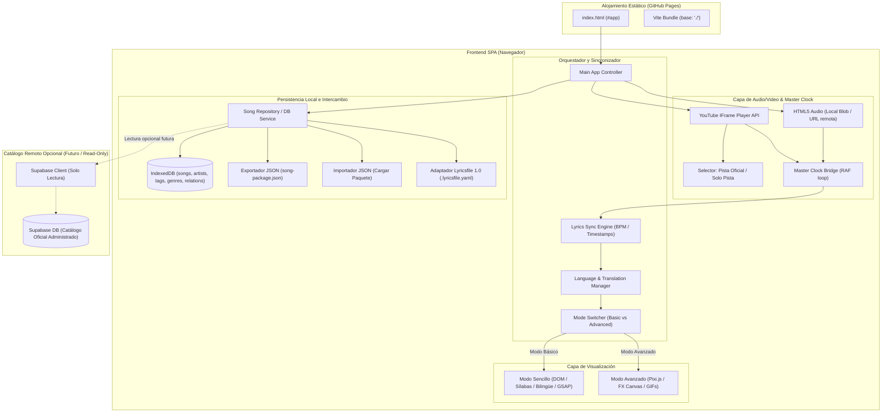

# Diseño Técnico y Arquitectura: SarangaBaranga (`proy-letras`)

> **Arquitectura del Sistema y Patrones de Software**  
> **Versión:** 2.3.0  
> **Plataforma:** SPA Estática (GitHub Pages / `usuario.github.io`) + Persistencia Local en Navegador (IndexedDB), Intercambio JSON & Compatibilidad con Estándar Abierto `lyricsfile` (.lyricsfile.yaml) (+ Catálogo Opcional Supabase Read-Only a futuro)

---

## 1. Visión General de la Arquitectura

**SarangaBaranga** opera como una aplicación web sin servidor propio (*Zero-Backend Architecture*), diseñada para compilarse como un conjunto de archivos estáticos (HTML, JS, CSS) compatibles con **GitHub Pages**.

La persistencia de datos y el catálogo de canciones se gestiona primariamente **en el navegador del usuario mediante IndexedDB**, implementando un modelo relacional estructurado (`artists`, `songs`, `tags`, `genres`, `song_tags`, `song_genres`) con campos JSON para configuraciones temporales, visuales y de letras multilingües (`lyrics_data`, `visuals_data`).

Para permitir compartir creaciones e interoperar con fuentes externas sin requerir login ni backend de validación de subidas:
1. **Exportación / Importación JSON:** Los usuarios pueden exportar sus canciones a archivos JSON portables (`song-package.json`) y compartirlos. Al importar un archivo, el sistema lo valida y lo almacena localmente en IndexedDB.
2. **Compatibilidad con Estándar `lyricsfile` (YAML):** Soporte nativo para importar y exportar archivos en formato abierto `.lyricsfile.yaml` ([especificación 1.0](https://github.com/tranxuanthang/lyricsfile/blob/main/SPECIFICATION.md)), permitiendo cargar canciones o traducciones desde repositorios comunitarios de letras.
3. **Catálogo Remoto Opcional (Futuro / Read-Only):** A futuro, la aplicación podrá consultar opcionalmente una instancia de Supabase en modo estrictamente de **Solo Lectura** como catálogo curado por el autor, manteniendo todas las operaciones de escritura y creación en el ámbito local o manual del administrador.

El audio se reproduce principalmente a través de la **YouTube IFrame Player API** (video oficial y solo pista) o mediante elementos de audio HTML5 para archivos locales/remotos.



---

## 2. Separación de Datos: Esquema Modular, Persistencia Local e Intercambio

Los datos de cada canción se desacoplan en **tres estructuras conceptuales**, facilitando tanto su almacenamiento relacional estructurado en el navegador (IndexedDB) como su exportación e importación en archivos JSON individuales o empaquetados:

### 2.1. `metadata` (Información General y Clasificación)
* **En Base de Datos Local:** Se distribuye entre el almacén relacional `songs` (`title`, `audio_path`), el almacén `artists` (`artist_id`) y los almacenes de relación `song_tags` y `song_genres`.
* **Estructura en Archivo (`metadata.json`):**
```json
{
  "title": "Nombre de la Canción",
  "artist": "Artista o Banda",
  "genres": ["Rock", "Pop"],
  "tags": ["acústico", "karaoke"],
  "audioPath": "songs/pista_demo.mp3",
  "youtubeUrlFull": "https://www.youtube.com/watch?v=abc123xyz",
  "youtubeUrlInstrumental": "https://www.youtube.com/watch?v=inst123xyz"
}
```

### 2.2. `basic` (Letra Multilingüe, Traducciones, Sílabas y Estilo) -> `songs.lyrics_data`
* **En Base de Datos Local:** Se almacena como objeto en el campo `lyrics_data` del registro en `songs`.
* **Soporte de Traducciones:** Soporta un número ilimitado de idiomas en el arreglo `languages`. Un único idioma está señalado con `isMain: true` (idioma original de la canción) y todos los demás con `isMain: false` (traducciones).
* **Estructura en Archivo (`basic.json` / `lyrics_data`):**
```json
{
  "timing": {
    "bpm": 120,
    "timeSignature": [4, 4],
    "syncMode": "timestamp" // "timestamp" (segundos) o "beat" (compases)
  },
  "styles": {
    "textColor": "#A0A0A0",
    "activeColor": "#FFD700",
    "translationColor": "#38BDF8",
    "backgroundColor": "#121212",
    "fontFamily": "system-ui, sans-serif",
    "fontSize": "2.2rem"
  },
  "youtube": {
    "full": "https://www.youtube.com/watch?v=abc123xyz",
    "instrumental": "https://www.youtube.com/watch?v=inst123xyz"
  },
  "languages": [
    {
      "code": "es",
      "name": "Español (Original)",
      "isMain": true,
      "plain": "Caminando por la ciudad\nBajo la luz del sol",
      "lines": [
        {
          "id": "line-es-1",
          "startTime": 10.5,
          "endTime": 14.0,
          "text": "Caminando por la ciudad",
          "syllables": [
            { "text": "Ca", "startTime": 10.5, "duration": 0.4 },
            { "text": "mi", "startTime": 10.9, "duration": 0.3 },
            { "text": "nan", "startTime": 11.2, "duration": 0.5 },
            { "text": "do ", "startTime": 11.7, "duration": 0.5 },
            { "text": "por ", "startTime": 12.3, "duration": 0.4 },
            { "text": "la ", "startTime": 12.8, "duration": 0.3 },
            { "text": "ciu", "startTime": 13.1, "duration": 0.4 },
            { "text": "dad", "startTime": 13.5, "duration": 0.5 }
          ]
        }
      ]
    },
    {
      "code": "en",
      "name": "English (Translation)",
      "isMain": false,
      "plain": "Walking through the city\nUnder the sunlight",
      "lines": [
        {
          "id": "line-en-1",
          "startTime": 10.5,
          "endTime": 14.0,
          "text": "Walking through the city",
          "syllables": [
            { "text": "Wal", "startTime": 10.5, "duration": 0.5 },
            { "text": "king ", "startTime": 11.0, "duration": 0.4 },
            { "text": "through ", "startTime": 11.4, "duration": 0.5 },
            { "text": "the ", "startTime": 11.9, "duration": 0.4 },
            { "text": "ci", "startTime": 12.3, "duration": 0.5 },
            { "text": "ty", "startTime": 12.8, "duration": 0.7 }
          ]
        }
      ]
    }
  ]
}
```

* **Reglas del Modelo Multilingüe:**
  1. **Unicidad del Idioma Principal:** Exactamente una pista lingüística debe tener `isMain: true`. Representa la versión cantada por el artista.
  2. **Traducciones Ilimitadas:** Cualquier número de pistas con `isMain: false`. Cada una mapea su contenido a timestamps de audio para visualización independiente o subtitulado simultáneo.
  3. **Retrocompatibilidad Automática:** Si un archivo JSON o registro previo contiene un arreglo `lines` directamente en la raíz de `lyrics_data` (esquema mono-idioma antiguo), el cargador de la aplicación lo migra en memoria al esquema multilingüe asignándolo a `{ code: 'und', name: 'Original', isMain: true, lines }`.

### 2.3. `advanced` (Efectos de GSAP y PixiJS) -> `songs.visuals_data`
* **En Base de Datos Local:** Se almacena como objeto en el campo `visuals_data` del registro en `songs`.
* **Estructura en Archivo (`advanced.json` / `visuals_data`):**
```json
{
  "enabled": true,
  "effects": [
    {
      "id": "fx-1",
      "triggerTime": 10.5,
      "type": "bgColorTransition",
      "params": { "toColor": "#1E1B4B", "duration": 1.2 }
    },
    {
      "id": "fx-2",
      "triggerTime": 25.0,
      "type": "shapeBurst",
      "params": { "shape": "stars", "count": 25, "palette": ["#FF007A", "#7928CA"] }
    },
    {
      "id": "fx-3",
      "triggerTime": 42.0,
      "type": "imageGifOverlay",
      "params": { "url": "https://media.giphy.com/media/...", "duration": 5.0, "position": "center" }
    }
  ]
}
```

### 2.4. Paquete de Canción Unificado (`song-package.json`)
Para compartir canciones entre usuarios sin depender de un servidor central, una canción completa se exporta e importa como un único objeto JSON que empaqueta todas las capas con sus múltiples idiomas:
```json
{
  "version": "1.1.0",
  "metadata": { ... },
  "basic": { ... }, // Incluye languages: [ principal, traducciones... ]
  "advanced": { ... }
}
```

### 2.5. Especificación y Compatibilidad con el Estándar Abierto `lyricsfile` (tranxuanthang/lyricsfile 1.0)

Para asegurar la máxima interoperabilidad con el ecosistema comunitario y reproductores modernos de letras sincronizadas, SarangaBaranga implementa compatibilidad nativa con la especificación abierta **Lyricsfile 1.0** ([tranxuanthang/lyricsfile](https://github.com/tranxuanthang/lyricsfile/blob/main/SPECIFICATION.md)).

#### 2.5.1. Estructura de un Archivo `.lyricsfile.yaml`
```yaml
version: '1.0'

metadata:
  title: 'Caminando por la ciudad'
  artist: 'Artista Ejemplo'
  language: 'es' # Código ISO 639-1
  duration_ms: 180000
  instrumental: false

lines:
  - text: 'Caminando por la ciudad'
    start_ms: 10500
    end_ms: 14000
    words:
      - text: 'Caminando '
        start_ms: 10500
        end_ms: 12300
      - text: 'por '
        start_ms: 12300
        end_ms: 12800
      - text: 'la '
        start_ms: 12800
        end_ms: 13100
      - text: 'ciudad'
        start_ms: 13100
        end_ms: 14000

plain: |
  Caminando por la ciudad
```

#### 2.5.2. Mapeo Bidireccional entre `lyricsfile` y SarangaBaranga

| Entidad / Campo `lyricsfile` 1.0 | Modelo Interno SarangaBaranga | Regla de Transformación y Normalización |
| :--- | :--- | :--- |
| `version` | String (`"1.0"`) | Verificación de versión compatible. |
| `metadata.title` | `songs.title` / `metadata.title` | Mapeo directo de título. |
| `metadata.artist` | `artists.name` / `metadata.artist` | Búsqueda o creación (*upsert*) del artista en IndexedDB. |
| `metadata.language` | `languages[i].code` | Código ISO 639-1 (`'es'`, `'en'`, `'ja'`, etc.). |
| `metadata.instrumental` | `songs.lyrics_data.instrumental` | Si es `true`, la pista omite renderizado de versos. |
| `metadata.offset_ms` | `timing.globalOffset` | Offset global en milisegundos (`offset_ms / 1000`). |
| `lines[i].text` | `lines[i].text` | Texto completo del verso. |
| `lines[i].start_ms` | `lines[i].startTime` | Conversión: `start_ms / 1000` (segundos flotantes). |
| `lines[i].end_ms` | `lines[i].endTime` | Conversión: `end_ms / 1000` (segundos flotantes). |
| `words[j].text` | `syllables[j].text` | Preservación de espacios para reconstruir exactamente la línea. |
| `words[j].start_ms` | `syllables[j].startTime` | Conversión: `start_ms / 1000`. |
| `words[j].end_ms` | `syllables[j].duration` | Duración calculada: `(end_ms - start_ms) / 1000`. |
| `plain` | `languages[i].plain` | Cadena multilínea de letra pura sin sincronización. |

#### 2.5.3. Flujos de Trabajo con `lyricsfile`
1. **Importar como Nueva Canción:** Un archivo `.lyricsfile.yaml` se procesa extrayendo metadata y asignando su contenido como el idioma principal (`isMain: true`) de la nueva canción.
2. **Importar como Traducción a Canción Existente:** El usuario puede seleccionar una canción en su biblioteca y ejecutar "Añadir traducción desde archivo Lyricsfile". El sistema parsea el YAML, detecta el código `language` e inserta una nueva pista en `languages` con `isMain: false`.
3. **Exportar a `lyricsfile`:** En el visor o editor, el usuario puede seleccionar cualquier pista de idioma (la original o una traducción) y exportarla como un archivo `.lyricsfile.yaml` válido para su uso en plataformas externas.

---

## 3. Modelo de Persistencia Local (IndexedDB) y Esquema de Datos

Para evitar la complejidad de autenticación de usuarios y verificación de subidas en un backend, la base de datos se ejecuta directamente en el navegador del cliente utilizando **IndexedDB**. 

Se mantiene de manera idéntica la estructura de entidades relacionales diseñada (`artists`, `songs`, `tags`, `genres`, `song_tags`, `song_genres`), garantizando integridad y modularidad.

### 3.1. Almacenes de Objetos en IndexedDB (`SarangaDB`)
* **`artists`**: `{ id: string | number, name: string }` (KeyPath: `id`, Index: `name`)
* **`songs`**: `{ id: string | number, title: string, artist_id: string | number, audio_path: string, lyrics_data: object, visuals_data: object, created_at: string }` (KeyPath: `id`, Index: `title`, `artist_id`)
* **`tags`**: `{ id: string | number, name: string }` (KeyPath: `id`, Index: `name`)
* **`genres`**: `{ id: string | number, name: string }` (KeyPath: `id`, Index: `name`)
* **`song_tags`**: `{ song_id: string | number, tag_id: string | number }` (Index: `song_id`, `tag_id`, KeyPath compuesto o autoincremental)
* **`song_genres`**: `{ song_id: string | number, genre_id: string | number }` (Index: `song_id`, `genre_id`, KeyPath compuesto o autoincremental)

### 3.2. Esquema Relacional Canónico de Referencia (SQL)
Este esquema SQL define la fuente de verdad del modelo conceptual y servirá a futuro si se conecta con un catálogo Supabase en modo sólo lectura:

```sql
-- 1. Tabla de artistas
CREATE TABLE artist (
	id BIGINT PRIMARY KEY GENERATED ALWAYS AS IDENTITY,
	name VARCHAR(255) NOT NULL
);

-- 2. Tabla principal de canciones
CREATE TABLE song (
	id BIGINT PRIMARY KEY GENERATED ALWAYS AS IDENTITY,
	created_at TIMESTAMPTZ DEFAULT NOW(),
	title VARCHAR(255) NOT NULL,
	artist_id BIGINT REFERENCES artists(id),
	audio_path VARCHAR(512), -- Ruta de archivo de audio o URL
	lyrics_data JSONB,       -- Estructura JSON con las marcas de tiempo (modo básico)
	visuals_data JSONB       -- Estructura JSON con los efectos de GSAP y PixiJS (modo avanzado)
);

-- 3. Tablas de categorización
CREATE TABLE tag (
	id BIGINT PRIMARY KEY GENERATED ALWAYS AS IDENTITY,
	name VARCHAR(255) NOT NULL
);

CREATE TABLE genre (
	id BIGINT PRIMARY KEY GENERATED ALWAYS AS IDENTITY,
	name VARCHAR(255) NOT NULL
);

-- 4. Tablas intermedias para relaciones N:M
CREATE TABLE song_tags (
	song_id BIGINT REFERENCES songs(id) ON DELETE CASCADE,
	tag_id BIGINT REFERENCES tags(id) ON DELETE CASCADE,
	PRIMARY KEY (song_id, tag_id)
);

CREATE TABLE song_genres (
	song_id BIGINT REFERENCES songs(id) ON DELETE CASCADE,
	genre_id BIGINT REFERENCES genres(id) ON DELETE CASCADE,
	PRIMARY KEY (song_id, genre_id)
);
```

### 3.3. Capa de Servicios Locales: `src/services/db.js` y `src/services/songService.js`
La aplicación utiliza un servicio de repositorio local que oculta la complejidad de IndexedDB y expone funciones asíncronas limpias con resolución de relaciones (joins lógicos):

```javascript
// src/services/songService.js
import { getDB } from './db.js'

export async function fetchSongById(songId) {
  const db = await getDB()
  const song = await db.get('songs', songId)
  if (!song) return null

  const artist = song.artist_id ? await db.get('artists', song.artist_id) : null
  const tagRelations = await db.getAllFromIndex('song_tags', 'song_id', songId)
  const tags = await Promise.all(tagRelations.map(rel => db.get('tags', rel.tag_id)))

  const genreRelations = await db.getAllFromIndex('song_genres', 'song_id', songId)
  const genres = await Promise.all(genreRelations.map(rel => db.get('genres', rel.genre_id)))

  return {
    ...song,
    artist,
    tags: tags.filter(Boolean),
    genres: genres.filter(Boolean)
  }
}
```

### 3.4. Motor de Exportación e Importación JSON (`src/services/shareService.js`)
* **`exportSongPackage(songId)`**: Recupera la canción con su artista, tags y géneros, construye el paquete `song-package.json` con todas sus pistas lingüísticas y desencadena la descarga en el navegador con `Blob` y enlace dinámico.
* **`importSongPackage(jsonFileOrString)`**: Parsea el archivo, valida su esquema, realiza *upsert* de artista, géneros y tags, inserta la canción y sus relaciones en IndexedDB y retorna el nuevo ID para su reproducción o edición inmediata.
* **`exportLibraryBackup()` / `importLibraryBackup()`**: Permite realizar un volcado completo de toda la base de datos local para respaldos o migración de navegador.

### 3.5. Servicio Adaptador para Estándar `lyricsfile` (`src/services/lyricsfileService.js`)
Servicio especializado en la interoperabilidad con la especificación abierta YAML 1.0 ([tranxuanthang/lyricsfile](https://github.com/tranxuanthang/lyricsfile/blob/main/SPECIFICATION.md)):
* **`parseLyricsfile(yamlString)`**: Parsea con seguridad el documento YAML, valida versión `"1.0"`, convierte `start_ms` y `end_ms` a segundos decimales y genera la estructura interna de `lines` y `syllables`.
* **`exportLanguageToLyricsfile(song, languageCode)`**: Extrae la pista solicitada (o el idioma principal `isMain: true` por defecto), normaliza los tiempos a milisegundos enteros, reconstruye el bloque `words` y `plain`, y descarga un archivo `.lyricsfile.yaml`.
* **`importLyricsfileAsTranslation(songId, yamlString)`**: Agrega el archivo parseado como una nueva traducción (`isMain: false`) en el arreglo `languages` de una canción existente.
* **`importLyricsfileAsNewSong(yamlString)`**: Crea una nueva canción en la base de datos local usando la metadata del archivo y estableciendo su letra como el idioma principal (`isMain: true`).

### 3.6. Integración Futura con Supabase (Catálogo Remoto Solo Lectura)
A futuro, se podrá añadir un conector opcional a Supabase con las siguientes premisas:
* **Modo Estricto Read-Only:** El cliente frontend no dispone de permisos de escritura ni requiere autenticación de usuarios en Supabase.
* **Curaduría Manual del Creador:** Las canciones oficiales son añadidas a Supabase exclusivamente por el autor desde el backend/dashboard de Supabase.
* **Descarga a Biblioteca Local:** El usuario puede navegar el catálogo público en línea e "importar a mi biblioteca", clonando la canción en su IndexedDB local para usarla offline y personalizarla.

---

## 4. Master Clock y Reproducción

La aplicación admite dos orígenes de audio bajo el mismo contrato de **Reloj Maestro**:

1. **YouTube IFrame API:** Cuando la canción utiliza video oficial o versión solo pista desde YouTube. Un bucle `requestAnimationFrame` sondea `player.getCurrentTime()`.
2. **Audio Nativo HTML5 / Archivo Local (`audio_path`):** Cuando la canción cuenta con un archivo de audio local (almacenado como Blob en IndexedDB o seleccionado mediante input file) o una URL de audio remota. El elemento `<audio>` emite eventos `timeupdate` de forma nativa o se reproduce vía Web Audio API.

En ambos casos, el **Sincronizador de Letras** consume un único valor normalizado: `currentTime` en segundos.

---

## 5. Implementación de los Dos Modos

### 5.1. Modo Sencillo / Básico (`BasicModeViewer`)
* **Datos fuente:** `songs.lyrics_data` (con soporte para colección `languages`).
* **Gestión Dinámica de Idiomas (`LanguageManager`):**
  * **Selector de Idioma:** Permite al usuario conmutar entre el idioma principal (`isMain: true`) y cualquiera de las traducciones disponibles (`isMain: false`).
  * **Modo de Subtitulado Simultáneo / Bilingüe:** 
    * El usuario puede activar la visualización dual: el visor muestra la línea en el **idioma principal** en tipografía destacada con resaltado sílaba a sílaba (`.active-syllable`), y simultáneamente en el renglón inferior muestra la línea correspondiente de la **traducción seleccionada** (con estilo secundario `--translation-color`).
    * La sincronización empareja los intervalos temporales (`startTime` y `endTime`) entre la pista principal y la traducción.
* **Renderizado DOM:**
  * Descompone los versos activos en elementos `<span>` por cada sílaba o palabra.
  * Cuando `currentTime` coincide con el intervalo de una sílaba, aplica la clase `.active-syllable` y realiza la animación de color o relleno (GSAP o CSS transitions).
* **Consumo de recursos:** Extremadamente bajo, optimizado para cualquier dispositivo móvil o de escritorio sin sobrecarga gráfica.

### 5.2. Modo Avanzado (`AdvancedModeViewer`)
* **Datos fuente:** `songs.visuals_data` + `songs.lyrics_data`.
* **Renderizado:**
  * Conserva la letra y el soporte multilingüe del modo básico.
  * Monta un canvas de [`pixi.js`](file:///home/hezztia/Documents/SarangaBaranga/package.json#L17) en el fondo.
  * Un despachador de eventos lee `visuals_data.effects` y ejecuta transiciones de color, partículas, geometrías o inserción de GIFs según los timestamps musicales.

---

## 6. Despliegue en GitHub Pages (`usuario.github.io`)

1. **Configuración de Vite:** Configurar `base: './'` en [`vite.config.js`](file:///home/hezztia/Documents/SarangaBaranga/vite.config.js) para que las rutas a scripts y assets sean relativas.
2. **Cero Dependencia de Servidores en Producción:** Todo el almacenamiento opera de forma local e independiente en el navegador del usuario (IndexedDB), garantizando una aplicación 100% estática, offline-first y sin riesgo de filtración de claves.
